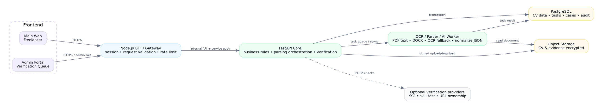

# FreelanceHub AI — CV Intelligence & Verification
## MASTER DOCUMENT — Tổng hợp toàn bộ nội dung gói handoff theo đúng đánh số gốc

> **Phiên bản tổng hợp:** v1.0
> **Ngày tổng hợp:** 02/08/2026
> **Nguồn:** Toàn bộ 16 file trong `FreelanceHub_AI_CV_Intelligence_Verification_Dev_Handoff_v1.0/`
> **Verdict gói handoff:** PASS FOR DEVELOPMENT KICKOFF (audit 01/08/2026)

---

## MỤC LỤC MASTER

| Phần | Nguồn gốc | Mục đích |
|---|---|---|
| **Phần A** | `PACKAGE-MANIFEST.md` + `HANDOFF-AUDIT-REPORT.md` + `FILE-CHECKSUMS-SHA256.txt` | Tổng quan gói handoff, manifest, audit, checksum |
| **Phần B** | `00-START-HERE/README-DEV.docx` | Hướng dẫn đọc + verdict + scope MVP + DoD |
| **Phần C** | `01-FEEDBACK/00-ORIGINAL-SOURCE-AUDIT.md` | Audit code source baseline (evidence cụ thể) |
| **Phần D** | `01-FEEDBACK/01-CV-MODULE-FEEDBACK-AND-GAPS.docx` | Feedback & Gap Report format doanh nghiệp |
| **Phần E** | `02-FUNCTIONAL-SPEC/02-CV-INTELLIGENCE-VERIFICATION-SPEC.docx` | Functional Spec (15 mục gốc) |
| **Phần F** | `02-FUNCTIONAL-SPEC/cv_architecture.dot` + PNG | Kiến trúc hệ thống |
| **Phần G** | `03-FRONTEND/03-CV-UI-CHANGE-BRIEF.docx` | UI Change Brief (1 quy tắc + 8 màn CV-01→CV-08) |
| **Phần H** | `03-FRONTEND/03-CV-SCREEN-CHANGE-LIST.xlsx` | Screen Change List (bảng) |
| **Phần I** | `04-DATA/04-CV-DATA-SCHEMA.json` | Data Schema JSON |
| **Phần J** | `04-DATA/04-CV-DATA-DICTIONARY.xlsx` | Data Dictionary (4 sheet) |
| **Phần K** | `05-API/05-CV-API-CONTRACT.md` (mục 1–13) | API Contract |
| **Phần L** | `06-STATE-MACHINE/06-CV-VERIFICATION-STATE-MACHINE.md` + DOT + PNG | State Machine |
| **Phần M** | `07-VERIFICATION/07-CV-VERIFICATION-RULES.md` (mục 1–7) | Verification Rules |
| **Phần N** | `08-BACKLOG/08-CV-MODULE-BACKLOG.xlsx` | Backlog |
| **Phần O** | `09-QA/09-CV-MODULE-QA-CHECKLIST.xlsx` | QA Checklist |
| **Phần P** | `10-SOURCE-BASELINE/SOURCE-BASELINE.md` | Source Baseline + mandatory changes |

---

# PHẦN A — TỔNG QUAN GÓI HANDOFF

## A.1. PACKAGE MANIFEST

### A.1.1. Main deliverables
- `00-START-HERE/README-DEV.docx`
- `01-FEEDBACK/01-CV-MODULE-FEEDBACK-AND-GAPS.docx`
- `02-FUNCTIONAL-SPEC/02-CV-INTELLIGENCE-VERIFICATION-SPEC.docx`
- `03-FRONTEND/03-CV-UI-CHANGE-BRIEF.docx`
- `03-FRONTEND/03-CV-SCREEN-CHANGE-LIST.xlsx`
- `03-FRONTEND/wireframes/*.png`
- `04-DATA/04-CV-DATA-SCHEMA.json`
- `04-DATA/04-CV-DATA-DICTIONARY.xlsx`
- `05-API/05-CV-API-CONTRACT.md`
- `06-STATE-MACHINE/06-CV-VERIFICATION-STATE-MACHINE.png`
- `07-VERIFICATION/07-CV-VERIFICATION-RULES.md`
- `08-BACKLOG/08-CV-MODULE-BACKLOG.xlsx`
- `09-QA/09-CV-MODULE-QA-CHECKLIST.xlsx`
- `10-SOURCE-BASELINE/SOURCE-BASELINE.md`

---

## A.2. CV INTELLIGENCE & VERIFICATION HANDOFF — AUDIT REPORT

### A.2.1. Tiêu đề & verdict
**Verdict:** PASS FOR DEVELOPMENT KICKOFF
**Audit date:** 01/08/2026 17:08

### A.2.2. Results
| Hạng mục | Kết quả |
|---|---:|
| Required file issues | 0 |
| DOCX valid | 4 |
| XLSX valid | 4 |
| JSON valid | 1 |
| Markdown files | 6 |
| PNG files valid | 12 |
| Wireframes | 8/8 |

### A.2.3. DOCX visual QA
- README-DEV: rendered and visually reviewed.
- Feedback & Gap Report: rendered and visually reviewed.
- Functional Specification: rendered and visually reviewed with portrait diagrams.
- UI Change Brief: rendered and visually reviewed across all eight wireframes.

### A.2.4. XLSX QA
- Screen Change List: no formula errors; dropdown Status present.
- Data Dictionary: entity, field, relationship and enum sheets created.
- Backlog: summary formulas and chart validated.
- QA Checklist: 35 cases, summary formulas and chart validated.

### A.2.5. Warnings
- Wireframes are low-fidelity developer references, not approved high-fidelity visual designs.
- Tech Lead must lock OCR provider, storage, retention, confidence threshold and Verified Profile policy before production implementation.

### A.2.6. Delivery boundary
This pack is a development specification. It does not mean OCR, parsing or verification has already been implemented. P0 QA must pass in the actual source before the feature can be called complete.

---

## A.3. FILE CHECKSUMS (SHA-256)

```
88b6d5c2a1ad34c6d7fec837c11096c5e07e7142a58b16df3af71379b6b346b2  00-START-HERE/README-DEV.docx
6a07769f88cbf2b754bb587fe00242f1745b0f57cc26c460a31518cbfefade27  01-FEEDBACK/00-ORIGINAL-SOURCE-AUDIT.md
c5189f4571da17cae7e6bce5cbec4c4b39b0d6a5ba86af8bf59adc87455e5cdd  01-FEEDBACK/01-CV-MODULE-FEEDBACK-AND-GAPS.docx
2bd0f6aedc8f8395f57930cc8c86d5b2c499651423fef562a3418c7910891940  02-FUNCTIONAL-SPEC/02-CV-INTELLIGENCE-VERIFICATION-SPEC.docx
2f54bb1047cf734eeb5be6840c4f6b48e0a0f7428d1aaf03a34f34207fd4d14a  02-FUNCTIONAL-SPEC/cv_architecture.dot
99fa992cd6e7b4d4247bff9f62dde944c38ebecdb7ac2cad1ad7086b2ba74f66  02-FUNCTIONAL-SPEC/cv_architecture.png
2054d848dec79c0a5d9cab02b5e82d7f34938a75280d8092597b4215dafa7241  02-FUNCTIONAL-SPEC/cv_architecture_portrait.png
dcf777f3190bdfb0147c9b8e74a4853e6ccfaa44723e089342a8b2b5500fef03  03-FRONTEND/03-CV-SCREEN-CHANGE-LIST.xlsx
bc6f258a682c539318cc02391bd6a4ba7947ac5302c637564f1fee453298b037  03-FRONTEND/03-CV-UI-CHANGE-BRIEF.docx
fef5283674cef77928098fffcdd71eeacd4b8ad92592418f3adaffb35f4c90bb  03-FRONTEND/wireframes/CV-01-UPLOAD.png
596a9d681052189738033c090711e682fc50908d40e5614a9f6d4eb9d230e35c  03-FRONTEND/wireframes/CV-02-PROCESSING.png
e63a64baac41d5a68d03f9775cf0ec7dbef3b1ef7f617c6ddd07c3ed340b6840  03-FRONTEND/wireframes/CV-03-PARSED-RESULT.png
0ce968e41c61868d9ad0f64623072a90245ab7d0b850a64079a37d73ba53b37b  03-FRONTEND/wireframes/CV-04-MISSING-INFO.png
40ee02ecbb8859d8312f2664ae7552d6613d6f2047c064396b4667a853946fd6  03-FRONTEND/wireframes/CV-05-EVIDENCE.png
6efb86d1c828beacc7af81319366d01982e1dfb913ba5177b5ddf4612489076a  03-FRONTEND/wireframes/CV-06-VERIFICATION-STATUS.png
f06595e413f7fc1e5be1b8a74226c1c2f72be9c508e20d7c7c438f8cf28c9117  03-FRONTEND/wireframes/CV-07-TRUST-PASSPORT.png
97d6a7176c15912791cb41bb27fe915e88994a852c3399c07928343a3b44a611  03-FRONTEND/wireframes/CV-08-ADMIN-REVIEW.png
0daec4f3e7a7b322eb70984734a14a3c6cf73fba4ebeb9dfde94c138b1d59d65  04-DATA/04-CV-DATA-DICTIONARY.xlsx
f098bbdff506c5b404aa85c5f791976e6f41ff82668d4e9dba4329cecaa8493b  04-DATA/04-CV-DATA-SCHEMA.json
e63816a8b429d28fe22aebf28bf10dc0dfb6826d46513667effbc57783590375  05-API/05-CV-API-CONTRACT.md
b6c9b04efb747006716a75b42677c7f1a93eded7b4abbf46f05217e4053872ae  06-STATE-MACHINE/06-CV-VERIFICATION-STATE-MACHINE.md
e1c40b6255d33184b17c3d9d44e00cbbfa6f9bec9d00d410f72611d99cd05022  06-STATE-MACHINE/06-CV-VERIFICATION-STATE-MACHINE.png
bbd08d986a5368897257e0e2d6842fb36a08551b3fbd052bdfa5130b6d6cb0b1  06-STATE-MACHINE/cv_state_machine.dot
4bd42e27acdb36e9d305cdffae17309bd68562ebf4cde0f59501febe0bb43592  06-STATE-MACHINE/cv_state_machine_portrait.png
e58706de5d784ff7758851760948542339c04dc429573e2d8ee3785312feeed5  07-VERIFICATION/07-CV-VERIFICATION-RULES.md
57bbbb137b40b60db6db230855c43de217ba7ac8609959ca67c05441b9ed5e96  08-BACKLOG/08-CV-MODULE-BACKLOG.xlsx
687d58657170a17b7ee9782ee5ab16754ea2f457d7b570c58b99b831b0c35be4  09-QA/09-CV-MODULE-QA-CHECKLIST.xlsx
32d31e70f1b0262e9375e6780073a53487452222b88da3716d8aa857de148fb9  10-SOURCE-BASELINE/SOURCE-BASELINE.md
20debef3c603c3c3dd87896833094fb6057e1d84a598bdd9c31fc675de137c6b  PACKAGE-MANIFEST.md
```

---

# PHẦN B — 00-START-HERE / README-DEV.docx

**FREELANCEHUB AI — CV INTELLIGENCE & VERIFICATION**
Developer Handoff Pack — đọc file này trước khi triển khai

- **Phiên bản:** v1.0
- **Ngày phát hành:** 01/08/2026
- **Phạm vi:** Freelancer CV Upload, OCR/Parsing, Verification, Trust Passport, Admin Review
- **Source baseline:** `demo_code.zip` — React/Vite demo

## B.1. Verdict và mục tiêu
Verdict: **Needs implementation** — source demo hiện chỉ mô phỏng.

Gói này thay thế việc feedback rời rạc qua chat bằng một bộ đặc tả thống nhất cho Frontend, Node.js BFF, FastAPI Core, Database, OCR/AI Worker, Admin Portal và QA.

## B.2. Các quyết định không được thay đổi khi code
1. Trạng thái mặc định của hồ sơ CV là `NOT_STARTED`; tuyệt đối không mặc định `Verified`.
2. `AI_EXTRACTED`, `USER_CONFIRMED` và `PLATFORM_VERIFIED` là ba mức bằng chứng khác nhau.
3. Người dùng bấm xác nhận dữ liệu không được tự chuyển hồ sơ sang `VERIFIED`.
4. Node.js là BFF/Gateway; FastAPI sở hữu business rules, state transition, database transaction và orchestration OCR/AI.
5. Admin Portal tách giao diện nhưng dùng chung API, database và verification case với Main Web.
6. PDF có text phải trích xuất trực tiếp trước; OCR chỉ dùng cho trang scan/ảnh hoặc text layer không đạt chất lượng.
7. Trust Passport phải đọc dữ liệu động và giải thích được mức bằng chứng của từng trường.
8. Tài chính, KYC và xác minh CV phải được mô tả là mô phỏng/sandbox nếu chưa tích hợp đối tác thật.

## B.3. Thứ tự đọc tài liệu

| Bước | File | Mục đích |
|---:|---|---|
| 1 | 01-CV-MODULE-FEEDBACK-AND-GAPS.docx | Hiểu gap của source hiện tại. |
| 2 | 02-CV-INTELLIGENCE-VERIFICATION-SPEC.docx | Chốt luồng chức năng và kiến trúc. |
| 3 | 03-CV-UI-CHANGE-BRIEF.docx | Frontend/Admin xem wireframe và screen behavior. |
| 4 | 03-CV-SCREEN-CHANGE-LIST.xlsx | Tech Lead phân owner, priority, status. |
| 5 | 04-CV-DATA-SCHEMA.json + DATA-DICTIONARY.xlsx | Backend/DB khóa schema. |
| 6 | 05-CV-API-CONTRACT.md | Node/FastAPI khóa request, response, error. |
| 7 | 06 State Machine + 07 Verification Rules | Khóa state transition và chống fake. |
| 8 | 08 Backlog + 09 QA Checklist | Lập sprint và kiểm thử. |

## B.4. Phạm vi MVP bắt buộc (P0)
- Chọn file thật, drag/drop, validation MIME, chữ ký file và dung lượng.
- Upload file lên object storage bằng signed URL hoặc multipart streaming.
- Phân loại PDF text, scanned PDF/image và DOCX.
- Trích xuất text/OCR và chuẩn hóa dữ liệu CV thành JSON có confidence, source page, source text.
- Phát hiện trường thiếu, dữ liệu xung đột và trường confidence thấp.
- Màn hình review cho người dùng sửa/bổ sung; lưu audit old/new values.
- Không tự `Verified`; gửi case sang `PENDING_VERIFICATION`.
- Trust Passport đọc dữ liệu động và hiển thị evidence level.
- Admin xem được hồ sơ, dữ liệu gốc, dữ liệu đã sửa, minh chứng và đưa ra quyết định có reason code.
- QA có test route/state, upload, async task, privacy, permission và audit log.

## B.5. Phân công đề xuất

| Owner | Trách nhiệm |
|---|---|
| Frontend Main Web | CV-01 đến CV-07, upload, processing, review, evidence, status, Trust Passport. |
| Frontend Admin | CV-08 Verification Detail và queue liên kết case thật. |
| Node.js BFF | Session, request shape validation, rate limit, CSRF, response mapping. |
| FastAPI Core | State machine, business validation, API nội bộ, DB transaction, orchestration. |
| OCR/AI | Document classification, text extraction, OCR fallback, normalize JSON, confidence. |
| Database | Migration, constraints, indexes, audit log, retention. |
| QA/Product | Acceptance, regression, data privacy, chống claim xác minh tuyệt đối. |

## B.6. Definition of Done của module
1. Không còn dữ liệu CV hard-code trong `UploadCV.tsx`.
2. Không còn control test cho phép đổi trực tiếp `Draft/Need More Info/Verified`.
3. Source demo không mặc định `Verified` trong `App.tsx`.
4. Refresh trang không làm mất task/case state.
5. Không có route dead-end, console error hoặc asset 404.
6. API và UI dùng cùng enum trạng thái.
7. Admin decision tạo audit log và cập nhật Trust Passport theo field.
8. P0 QA cases đều Pass trước khi demo.

---

# PHẦN C — 01-FEEDBACK / 00-ORIGINAL-SOURCE-AUDIT.md

# AUDIT TÍNH NĂNG UPLOAD CV, OCR, CV PARSING VÀ XÁC MINH HỒ SƠ

## C.1. Kết luận
**Verdict: Critical Gap / Needs Revision.**

Bản demo hiện chỉ có giao diện mô phỏng luồng upload và xác nhận CV. Không có OCR thật, không đọc file thật, không phát hiện trường thiếu, không có cơ chế xác minh chống CV giả và không đồng bộ dữ liệu CV đã chỉnh sửa vào hồ sơ/Trust Passport.

## C.2. Bằng chứng chính

### C.2.1. Upload file chỉ là mô phỏng
- `src/pages/UploadCV.tsx:184-194`: vùng upload là một `div` có `onClick`, không có `<input type="file">`.
- `src/pages/UploadCV.tsx:40-47`: click chỉ đặt `fileSelected=true` và hiển thị tên file hard-code.
- `src/pages/UploadCV.tsx:202-203`: tên file và dung lượng đều hard-code.
- Không có `File`, `FileReader`, `FormData`, drag/drop handler, MIME validation hay upload API.

### C.2.2. OCR/CV parsing không tồn tại
- `src/pages/UploadCV.tsx:49-67`: "phân tích" chỉ là `setTimeout(..., 1200)`.
- `src/pages/UploadCV.tsx:27-38`: dữ liệu kỹ năng, kinh nghiệm, công cụ và dự án được khởi tạo sẵn bằng chuỗi cố định.
- `package.json`: chỉ có React, React DOM và Lucide; không có thư viện OCR, PDF/DOCX parser hay SDK AI.
- Không có `fetch`, `axios` hoặc API call trong source.

### C.2.3. Không có phát hiện dữ liệu thiếu
- Chỉ có 4 trường chỉnh sửa: kinh nghiệm, kỹ năng, công cụ, dự án.
- Không có completeness score, confidence score, required-field map hoặc missing-field list.
- Trạng thái `Need More Info` chỉ là nút test trong `UploadCV.tsx:343-374`; không được sinh ra từ kết quả phân tích.

### C.2.4. Xác minh hồ sơ chỉ là đổi trạng thái
- `src/pages/UploadCV.tsx:70-82`: bấm xác nhận lập tức đặt trạng thái `Verified` và redirect.
- Không có kiểm tra bằng chứng, đối chiếu nguồn, admin review, KYC, skill test hoặc portfolio verification.
- `src/App.tsx:60`: trạng thái mặc định là `Verified`, khiến người dùng mới có thể thấy hồ sơ đã xác minh trước khi upload.

### C.2.5. Trust Passport không nhận dữ liệu từ CV upload
- `src/App.tsx:747-751`: Trust Passport luôn nhận `freelancers[0]` từ mock data.
- `src/data/mockData.ts:200-233`: profile, badges, trust score, portfolio là dữ liệu cố định.
- `src/pages/UploadCV.tsx` không có callback cập nhật freelancer model; dữ liệu người dùng chỉnh sửa bị mất khi rời trang.
- Có thể xảy ra mâu thuẫn: trạng thái CV là Draft nhưng Trust Passport vẫn hiển thị badge `Verified Profile`.

### C.2.6. Admin verification queue không liên kết
- `src/pages/AdminDashboard.tsx:13-17`: queue là mảng mock cục bộ.
- `src/pages/AdminDashboard.tsx:39-49`: approve/reject chỉ xóa item khỏi state và hiện toast.
- Không mở được hồ sơ, không xem CV gốc, không xem evidence, không ghi quyết định hay audit log.

### C.2.7. Không có chống CV giả
Không tìm thấy code cho:
- checksum/file hash và duplicate detection;
- kiểm tra metadata/tampering;
- xác minh email công ty, LinkedIn, GitHub, bằng cấp/chứng chỉ;
- đối chiếu employment timeline;
- portfolio URL ownership;
- skill assessment;
- KYC/identity binding;
- risk score, evidence status hoặc manual review workflow.

## C.3. Mức độ hoàn thiện hiện tại

| Năng lực | Trạng thái |
|---|---|
| UI upload CV | Có, nhưng mock |
| Chọn file thật | Không |
| Kiểm tra định dạng/dung lượng | Không |
| Lưu file | Không |
| OCR ảnh/scanned PDF | Không |
| Parse PDF text/DOCX | Không |
| Chuẩn hóa dữ liệu CV | Không |
| Cho người dùng chỉnh dữ liệu | Có một phần, 4 trường |
| Phát hiện trường thiếu | Không |
| Confidence theo trường | Không |
| Đồng bộ profile | Không |
| Xác minh portfolio | Không |
| Xác minh kinh nghiệm/bằng cấp | Không |
| Manual verification | Chỉ mock rời rạc |
| Trust Passport động | Không |
| Audit trail | Không |

## C.4. Kiến trúc tối thiểu đề xuất
1. Frontend gửi file thật bằng multipart upload.
2. Backend lưu file tạm, tạo `cv_document` và `parsing_task`.
3. Phân loại PDF text / scanned PDF / DOCX.
4. OCR cho scanned pages; parser cho PDF text và DOCX.
5. AI chuẩn hóa thành JSON schema có `value`, `source_page`, `confidence`.
6. So sánh với hồ sơ hiện tại và sinh `missing_fields`, `conflicts`, `evidence_required`.
7. Người dùng review/chỉnh sửa và bổ sung minh chứng.
8. Verification engine đối chiếu portfolio, skill test, KYC và lịch sử giao dịch.
9. Hồ sơ chuyển `PENDING_VERIFICATION`, không tự động thành `VERIFIED`.
10. Admin review và ghi audit log; Trust Passport chỉ hiển thị evidence đã xác minh.

## C.5. Trạng thái đề xuất
`DRAFT -> UPLOADED -> OCR_PROCESSING -> PARSED -> NEEDS_USER_REVIEW -> NEEDS_EVIDENCE -> PENDING_VERIFICATION -> VERIFIED / PARTIALLY_VERIFIED / REJECTED`

## C.6. Ưu tiên sửa

### C.6.1. P0
- File input thật + validation.
- API upload/parsing task.
- OCR/parser pipeline.
- Parsed schema và missing-field detection.
- Review form đầy đủ.
- Không mặc định `Verified`.
- Trust Passport lấy dữ liệu động.

### C.6.2. P1
- Evidence upload và verification queue liên kết.
- Portfolio URL verification, skill test, KYC binding.
- Risk/conflict score và audit log.

### C.6.3. P2
- Employment/reference verification nâng cao.
- Duplicate CV/fraud graph và anomaly detection.

---

# PHẦN D — 01-FEEDBACK / 01-CV-MODULE-FEEDBACK-AND-GAPS.docx

**FREELANCEHUB AI — CV MODULE FEEDBACK & GAP REPORT**
Audit source demo và yêu cầu sửa để triển khai OCR, parsing, verification

- **Phiên bản:** v1.0
- **Ngày phát hành:** 01/08/2026
- **Phạm vi:** Freelancer CV Upload, OCR/Parsing, Verification, Trust Passport, Admin Review
- **Source baseline:** `demo_code.zip` — React/Vite demo

## D.1. Executive summary
Verdict: **Critical Gap.**

Source hiện có UI upload/stepper nhưng không có upload file thật, OCR, parser, missing-field detection, evidence verification hoặc đồng bộ Trust Passport. Phần xác minh hiện chỉ đổi local state và có thể tự gắn Verified.

## D.2. Bằng chứng từ source baseline

| Source | Phát hiện |
|---|---|
| src/pages/UploadCV.tsx | Vùng upload là div onClick; không có input type=file, File, FormData hoặc API. |
| src/pages/UploadCV.tsx | handleParse chỉ setTimeout 1.2 giây; dữ liệu kết quả được khởi tạo sẵn. |
| src/pages/UploadCV.tsx | handleConfirm đặt Verified và redirect; không có verification case. |
| src/App.tsx | profileVerificationStatus mặc định là Verified nếu localStorage trống. |
| src/App.tsx | AITrustPassport nhận freelancers[0] từ mockData. |
| src/pages/AdminDashboard.tsx | Verification queue là array local; approve/reject chỉ xóa item. |
| package.json | Không có OCR, PDF/DOCX parser, API client hoặc AI SDK. |

## D.3. Current behavior vs expected behavior

| Hạng mục | Hiện tại | Yêu cầu |
|---|---|---|
| Chọn file | Click đổi fileSelected=true, tên file hard-code. | File input thật, drag/drop, validation và upload. |
| OCR/Parsing | setTimeout + dữ liệu mẫu. | PDF text parser, DOCX parser, OCR fallback, normalize JSON. |
| Thông tin thiếu | Không sinh missingFields. | Completeness score và yêu cầu bổ sung theo field. |
| Confidence | Không có. | Confidence + source page/source text cho từng trường. |
| Xác nhận | Người dùng tự Verified. | Chỉ USER_CONFIRMED; tạo verification case riêng. |
| Trust Passport | Mock freelancers[0]. | Dữ liệu động theo field evidence level. |
| Admin review | Queue mock không liên kết. | Case detail, evidence, decision, reason code, audit log. |
| Chống fake | Không có. | Hash, duplicate flag, timeline, portfolio ownership, evidence review. |
| Ứng tuyển | Không kiểm tra trạng thái hồ sơ. | Rule rõ ràng theo business policy; không dựa vào UI badge. |

## D.4. Rủi ro nếu không sửa

| Mức | Rủi ro | Hậu quả |
|---|---|---|
| Critical | Fake verification | Người dùng có thể tự gắn Verified; Trust Passport mất uy tín. |
| Critical | Data integrity | CV chỉnh sửa không lưu; hồ sơ và Trust Passport mâu thuẫn. |
| High | Demo failure | BGK/Dev test file khác vẫn nhận kết quả hard-code. |
| High | Security/privacy | Không có quy tắc upload, storage, signed URL, audit hoặc retention. |
| High | Backend rework | Nếu code UI trước khi khóa schema/state, nhiều màn hình phải viết lại. |
| Medium | AI cost | OCR chạy mọi file gây chi phí không cần thiết; cần direct extraction first. |

## D.5. Required fixes

### D.5.1. P0 — trước MVP demo
- File input thật và upload API.
- PDF/DOCX parser, OCR fallback, normalize schema.
- Task progress thật: `taskId`, polling, retry, fail state.
- Missing fields, conflicts, confidence và provenance.
- Review form đầy đủ, lưu old/new value.
- Default `NOT_STARTED`; xóa control tự set `Verified`.
- Trust Passport dynamic.
- Admin verification case liên kết thật.

### D.5.2. P1 — xác minh có bằng chứng
- Evidence upload, portfolio ownership, skill test, KYC binding.
- Risk score, field-level verification và audit log.
- Admin request more info / partially verify / verify / reject.

### D.5.3. P2 — fraud nâng cao
- Duplicate CV detection giữa tài khoản.
- Timeline anomaly và employment/reference verification.
- Metadata analysis, fraud graph và device/account correlation.

## D.6. Tiêu chí chấp nhận feedback
- Dev xác nhận hiểu đây là module mới, không phải chỉnh vài text UI.
- Tech Lead chốt state machine, schema và API trước khi merge frontend.
- Product duyệt wireframe CV-01 đến CV-08.
- QA tạo test cases theo gói này.
- Không dùng từ "đã đối soát/đã đóng băng bảo mật" nếu chưa có cơ chế kỹ thuật.

---

# PHẦN E — 02-FUNCTIONAL-SPEC / 02-CV-INTELLIGENCE-VERIFICATION-SPEC.docx

**FREELANCEHUB AI — CV INTELLIGENCE & VERIFICATION SPECIFICATION**
Functional, technical and operational specification for MVP implementation

- **Phiên bản:** v1.0
- **Ngày phát hành:** 01/08/2026
- **Phạm vi:** Freelancer CV Upload, OCR/Parsing, Verification, Trust Passport, Admin Review
- **Source baseline:** `demo_code.zip` — React/Vite demo

## E.1. Mục tiêu sản phẩm
Biến CV thành dữ liệu hồ sơ có cấu trúc để phục vụ matching, đồng thời tách rõ dữ liệu AI đọc được, dữ liệu người dùng xác nhận và dữ liệu nền tảng đã xác minh. Module giảm nhập liệu thủ công nhưng không tuyên bố ngăn chặn tuyệt đối CV giả.

## E.2. Actor và quyền

| Actor | Trách nhiệm |
|---|---|
| Freelancer | Upload CV, review, bổ sung, tải minh chứng, theo dõi case. |
| Admin/Moderator | Xem queue, review evidence, yêu cầu bổ sung, quyết định. |
| Node.js BFF | Session, validation biên, rate limit, response mapping. |
| FastAPI Core | Business rules, state transitions, DB, orchestration. |
| OCR/AI Worker | Extract/OCR/normalize; không quyết định Verified. |
| Object Storage | Lưu CV/evidence mã hóa, signed URL. |

## E.3. Kiến trúc đề xuất
Main Web và Admin Portal là hai frontend riêng nhưng dùng chung Node BFF, FastAPI Core, database và verification case. FastAPI không chỉ là database wrapper; nó sở hữu business rule và transaction.

## E.4. Luồng end-to-end
1. Freelancer chọn file thật; frontend kiểm tra sơ bộ.
2. Node BFF tạo upload session; file được đẩy lên object storage.
3. FastAPI tạo `cv_document` và parsing task.
4. Worker phân loại tài liệu: PDF text, scanned PDF/image hoặc DOCX.
5. Trích xuất text trực tiếp; OCR fallback cho trang scan.
6. AI chuẩn hóa JSON, confidence và provenance.
7. FastAPI tính completeness, missing fields, conflicts và evidence required.
8. Freelancer review, sửa, bổ sung và xác nhận.
9. Freelancer tải minh chứng và gửi verification case.
10. Admin review, quyết định và ghi audit log.
11. Trust Passport cập nhật theo từng field evidence level.

## E.5. Chiến lược xử lý tài liệu

| Loại tài liệu | Cách xử lý |
|---|---|
| PDF có text | Extract text trực tiếp; đo chất lượng text; OCR chỉ trang lỗi. |
| PDF scan | Render từng trang và OCR; giữ page mapping. |
| DOCX | Parse paragraph/table; không thực thi macro. |
| PNG/JPG | OCR toàn ảnh; xoay ảnh và deskew khi cần. |

- Mỗi field lưu `sourcePage` và `sourceText` để người dùng/Admin kiểm tra.
- Không đưa raw CV hoặc dữ liệu nhạy cảm vào log.
- OCR/AI output không được ghi đè hồ sơ trước khi người dùng review.
- Version hóa schema và prompt/parser để tái lập kết quả.

## E.6. Data completeness và conflict detection

| Loại | Quy tắc |
|---|---|
| Bắt buộc | Họ tên, contact, professional title, ít nhất 1 skill, và ít nhất 1 experience/education/project. |
| Confidence thấp | < 0.70: bắt buộc review. |
| Missing | Không tìm thấy hoặc giá trị rỗng. |
| Conflict | Khác dữ liệu hồ sơ hiện tại, timeline chồng chéo, tên khác nhau. |
| Evidence required | Các claim quan trọng cần minh chứng theo rule. |

## E.7. Mô hình xác minh

| Evidence level | Ý nghĩa |
|---|---|
| AI_EXTRACTED | AI/parser đọc từ CV; chưa được người dùng hoặc nền tảng xác nhận. |
| USER_CONFIRMED | Freelancer đã review/sửa; vẫn là self-declared. |
| PLATFORM_VERIFIED | Có evidence/check/admin decision đủ điều kiện. |
| REJECTED | Claim/evidence không đạt; không hiển thị như verified. |

## E.8. State machine
Tham chiếu `06-STATE-MACHINE/06-CV-VERIFICATION-STATE-MACHINE.png`.

## E.9. Screen specification summary

| Code | Screen | Core behavior |
|---|---|---|
| CV-01 | Upload CV | File input thật, validation, signed upload. |
| CV-02 | Processing | Task progress, polling, retry/cancel/error. |
| CV-03 | Parsed Result | Field, confidence, source, edit/confirm. |
| CV-04 | Missing Information | Required fields và conflict resolution. |
| CV-05 | Evidence Upload | Field-level evidence và privacy note. |
| CV-06 | Verification Status | Timeline, request-more-info, outcome. |
| CV-07 | Trust Passport | Dynamic evidence level và explainable score. |
| CV-08 | Admin Review Detail | Original vs edited vs evidence, decision. |

## E.10. Async task requirements
- Start parsing returns 202 + `taskId`.
- Poll every 2 seconds; server controls `retryAfterMs`.
- Progress is monotonic; `currentStep` is display-safe.
- Timeout 90 seconds for UI; backend task may continue and notify later.
- Maximum automatic retry: 3.
- Task status survives page refresh.
- Cancel is best-effort; a completed result remains immutable by task.

## E.11. Security và privacy
- Signed URL thời hạn ngắn; object storage mã hóa.
- Malware scan và file signature validation.
- Least privilege cho Admin Portal; field-level access khi cần.
- Không log raw CV, signed URL, số giấy tờ hoặc evidence content.
- Configurable retention và delete/export workflow.
- Audit mọi edit, evidence, decision và Trust Passport update.

## E.12. Performance targets cho MVP

| Operation | Target |
|---|---|
| Upload session API | p95 < 800 ms, chưa tính truyền file. |
| PDF text parse | Mục tiêu < 15 giây với CV 1–4 trang. |
| OCR scan | Mục tiêu < 45 giây với CV 1–4 trang. |
| Task poll | p95 < 500 ms. |
| Admin detail | p95 < 1 giây với dữ liệu đã chuẩn bị. |

## E.13. Error handling
- Mọi lỗi có error code ổn định, message tiếng Việt và `retryable` flag.
- Không hiển thị stack trace hoặc provider error trực tiếp.
- `PARSING_FAILED` giữ file và cho retry.
- Version conflict yêu cầu reload kết quả mới trước khi ghi đè.
- Admin decision lỗi không được làm thay đổi một phần dữ liệu.

## E.14. MVP acceptance criteria

| Area | Acceptance |
|---|---|
| Upload | Người dùng chọn file thật; file lỗi bị chặn. |
| Parsing | Hai CV khác nhau trả dữ liệu khác nhau; không hard-code. |
| Review | Edit được lưu và audit; refresh không mất. |
| Missing | Trường thiếu sinh ra từ result. |
| Verification | Confirm không tự Verified. |
| Admin | Case thật xuất hiện trong Admin Portal. |
| Trust Passport | Field-level evidence dynamic. |
| Runtime | Không console error, API error không xử lý hoặc dead-end. |

## E.15. Open decisions Tech Lead phải chốt
1. Object storage và malware scanning service.
2. OCR engine MVP và fallback provider.
3. AI normalization model/prompt versioning.
4. Retention period của CV, raw text và evidence.
5. Ngưỡng confidence và rule completeness chính thức.
6. Điều kiện tối thiểu để hiển thị Verified Profile.
7. SLA Admin review và policy appeal.
8. Business rule: hồ sơ chưa verified có được ứng tuyển hay chỉ bị hạn chế?

---

# PHẦN F — 02-FUNCTIONAL-SPEC / cv_architecture (DOT + PNG)

## F.1. Diagram DOT (nguồn)



## F.2. Diagram ASCII (tương đương hình PNG)

```
┌───────────────────┐         ┌──────────────────────┐
│  Main Web         │         │  Admin Portal        │
│  (Freelancer)     │         │  (Verification Queue)│
└─────────┬─────────┘         └─────────┬────────────┘
          │ HTTPS                       │ HTTPS / admin role
          ▼                             ▼
┌─────────────────────────────────────────────────────┐
│   Node.js BFF / Gateway                              │
│   session • request validation • rate limit • CSRF   │
└────────────────────────┬────────────────────────────┘
                         │ internal API + service auth
                         ▼
┌─────────────────────────────────────────────────────┐
│   FastAPI Core                                       │
│   business rules • parsing orchestration • verify   │
└─────┬───────────────┬──────────────────┬────────────┘
      │ task/queue    │                  │
      ▼               ▼                  ▼
┌───────────────┐ ┌──────────┐ ┌──────────────────────┐
│ OCR / Parser  │ │PostgreSQL│ │ Object Storage       │
│ / AI Worker   │ │ CV • task│ │ CV & evidence mã hóa │
│ PDF text •    │ │ • case • │ │ signed URL           │
│ DOCX • OCR    │ │ audit    │ │                      │
│ fallback •    │ └──────────┘ └──────────────────────┘
│ normalize JSON│
└───────────────┘
(P1/P2 gọi Optional verification providers:
 KYC • skill test • URL ownership)
```

## F.3. Các file hình ảnh
- `cv_architecture.png` — landscape render.
- `cv_architecture_portrait.png` — portrait render.

---

# PHẦN G — 03-FRONTEND / 03-CV-UI-CHANGE-BRIEF.docx

**FREELANCEHUB AI — CV UI CHANGE BRIEF**
Low-fidelity developer wireframes — không phải visual design final

- **Phiên bản:** v1.0
- **Ngày phát hành:** 01/08/2026
- **Phạm vi:** Freelancer CV Upload, OCR/Parsing, Verification, Trust Passport, Admin Review
- **Source baseline:** `demo_code.zip` — React/Vite demo

## G.1. Quy tắc sử dụng
- Wireframe dùng để khóa layout, data, CTA và states; Dev vẫn dùng design system FreelancerHub.
- Không nhúng ảnh wireframe thành UI.
- Mỗi màn hình phải có loading, empty, error và success khi phù hợp.
- Desktop-first; responsive tablet/mobile thực hiện sau khi desktop pass.
- Tên route và state phải khớp Screen Change List.

## G.2. CV-01-UPLOAD — Upload CV

**Source mapping:** `UploadCV.tsx`
**Components/behavior:**
- File input hidden + drag/drop zone
- File preview: name, type, size, remove
- Validation message gần upload
- CTA Upload & bắt đầu phân tích

**Required states:** `NOT_STARTED`, `UPLOAD_FAILED`, `UPLOADED`

## G.3. CV-02-PROCESSING — AI Processing

**Source mapping:** `UploadCV.tsx` hoặc `CVProcessingPanel.tsx`
**Components/behavior:**
- Task ID và file name
- Progress bar + current step
- Polling/retry/cancel
- Không dùng setTimeout giả lập

**Required states:** `QUEUED`, `RUNNING`, `PARSING_FAILED`, `SUCCEEDED`

## G.4. CV-03-PARSED-RESULT — Parsed Result

**Source mapping:** `CVReviewPage.tsx`
**Components/behavior:**
- Field editor
- Confidence badge
- Source page/source text
- Completeness/missing/conflict summary

**Required states:** `NEEDS_USER_REVIEW`

## G.5. CV-04-MISSING-INFO — Missing Information

**Source mapping:** `CVMissingInfoForm.tsx`
**Components/behavior:**
- Required vs recommended fields
- Validation
- Save draft
- Audit changes

**Required states:** `NEEDS_MORE_INFO`

## G.6. CV-05-EVIDENCE — Evidence Upload

**Source mapping:** `CVEvidencePage.tsx`
**Components/behavior:**
- Evidence by field
- Signed upload
- Privacy notice
- Submit verification

**Required states:** `NEEDS_EVIDENCE`

## G.7. CV-06-VERIFICATION-STATUS — Verification Status

**Source mapping:** `CVVerificationStatus.tsx`
**Components/behavior:**
- Case timeline
- Admin request-more-info
- Outcome
- Re-submit path

**Required states:** `PENDING_VERIFICATION`, `PARTIALLY_VERIFIED`, `VERIFIED`, `REJECTED`

## G.8. CV-07-TRUST-PASSPORT — Dynamic Trust Passport

**Source mapping:** `AITrustPassport.tsx`
**Components/behavior:**
- Score source
- Evidence level per field
- Verification date/expiry
- No fake Verified badge

**Required states:** `PARTIALLY_VERIFIED`, `VERIFIED`, `EXPIRED`

## G.9. CV-08-ADMIN-REVIEW — Admin Review Detail

**Source mapping:** Admin Portal — `VerificationDetail.tsx`
**Components/behavior:**
- Original vs edited vs evidence
- Risk flags/checks
- Reason code + notes
- Request/partial/verify/reject

**Required states:** `PENDING`, `NEEDS_MORE_INFO`, `PARTIALLY_VERIFIED`, `VERIFIED`, `REJECTED`

---

# PHẦN H — 03-FRONTEND / 03-CV-SCREEN-CHANGE-LIST.xlsx

**FreelanceHub AI — CV Screen Change List v1.0**

## H.1. Sheet: Screen Changes

| Code | Flow | Screen | Current Source | Canonical Route | Current Gap | Required Change | Main Components | Data/API | Required States | Priority | Owner | Dependency | Definition of Done | Status |
|---|---|---|---|---|---|---|---|---|---|---|---|---|---|---|
| CV-01 | Freelancer | Upload CV | src/pages/UploadCV.tsx | /freelancer/upload | div onClick; không có file input/upload thật | Thêm input file, drag/drop, MIME/signature/size validation, signed upload | CVUploadZone; FilePreview; UploadError | POST /bff/v1/freelancer/cv/uploads | NOT_STARTED; UPLOAD_FAILED; UPLOADED | P0 | Frontend Main | Storage/API session | Chọn file thật; file lỗi bị chặn; upload session thành công | Todo |
| CV-02 | Freelancer | AI Processing | src/pages/UploadCV.tsx | /freelancer/upload (internal state) | setTimeout 1.2 giây; progress giả | taskId, polling, progress, currentStep, retry, cancel | CVProcessingPanel; ProgressBar; RetryPanel | POST parse; GET task | QUEUED; RUNNING; PARSING_FAILED; SUCCEEDED | P0 | Frontend Main + FastAPI | CV-01; worker | Refresh không mất task; lỗi có retry; không setTimeout giả | Todo |
| CV-03 | Freelancer | Parsed Result | NEW: CVReviewPage.tsx | /freelancer/upload (internal state) | 4 field hard-code; không confidence/provenance | Render schema động; edit field; confidence; source page/text | FieldEditor; ConfidenceBadge; SourcePreview; CompletenessCard | GET result; PATCH review | NEEDS_USER_REVIEW | P0 | Frontend Main | CV-02; schema | Hai CV khác nhau có result khác nhau; edit lưu được | Todo |
| CV-04 | Freelancer | Missing Information | NEW: CVMissingInfoForm.tsx | /freelancer/upload (internal state) | Không có missing-field detection | Form theo missingFields/conflicts; required/recommended; save draft | MissingFieldForm; ConflictResolver | PATCH review | NEEDS_MORE_INFO | P0 | Frontend Main + FastAPI | CV-03 | Trường thiếu sinh từ API; validation đúng; audit old/new | Todo |
| CV-05 | Freelancer | Evidence Upload | NEW: CVEvidencePage.tsx | /freelancer/verification/evidence | Không có evidence | Upload evidence theo field; signed URL; privacy; submit | EvidenceCard; EvidenceUploader; ConsentPanel | POST evidence; POST submit-verification | NEEDS_EVIDENCE; PENDING_VERIFICATION | P1 | Frontend Main + FastAPI | CV-04; storage | Evidence liên kết field/case; upload an toàn; submit tạo case | Todo |
| CV-06 | Freelancer | Verification Status | NEW: CVVerificationStatus.tsx | /freelancer/verification/:caseId | Không có case status thật | Timeline, request more info, outcomes, re-submit | VerificationTimeline; RequestCard; OutcomePanel | GET verification case | PENDING_VERIFICATION; PARTIALLY_VERIFIED; VERIFIED; REJECTED | P1 | Frontend Main | CV-05; admin API | Refresh giữ state; request-more-info có path bổ sung | Todo |
| CV-07 | Freelancer | Dynamic Trust Passport | src/components/AITrustPassport.tsx | /freelancer/trust-passport | Dùng freelancers[0] mock; badge có thể mâu thuẫn | Đọc API động; evidence level theo field; score explanation; expiry | TrustScore; EvidenceBadge; VerifiedFieldList | GET /bff/v1/freelancer/trust-passport | PARTIALLY_VERIFIED; VERIFIED; EXPIRED | P0 | Frontend Main + FastAPI | CV-03; CV-06 | Không hiển thị Verified khi chưa đủ PLATFORM_VERIFIED | Todo |
| CV-08 | Admin | Admin Verification Detail | src/pages/AdminDashboard.tsx → Admin Portal | /admin/verifications/:caseId | Queue local; không xem CV/evidence; approve/reject chỉ xóa state | Case detail; original vs edited vs evidence; checks; reason-coded decision | VerificationComparison; RiskPanel; DecisionForm; AuditHistory | GET detail; PATCH decision | PENDING; NEEDS_MORE_INFO; PARTIALLY_VERIFIED; VERIFIED; REJECTED | P1 | Frontend Admin + FastAPI | CV-05; role permission | Decision idempotent; audit log; Trust Passport cập nhật | Todo |

### H.1.1. Wireframes (low-fi developer reference)
- `CV-01-UPLOAD.png`
- `CV-02-PROCESSING.png`
- `CV-03-PARSED-RESULT.png`
- `CV-04-MISSING-INFO.png`
- `CV-05-EVIDENCE.png`
- `CV-06-VERIFICATION-STATUS.png`
- `CV-07-TRUST-PASSPORT.png`
- `CV-08-ADMIN-REVIEW.png`

---

# PHẦN I — 04-DATA / 04-CV-DATA-SCHEMA.json

```json
{
  "title": "FreelanceHub AI CV Intelligence & Verification Data Contract",
  "version": "1.0.0",
  "role_enum": ["enterprise", "freelancer", "admin"],

  "document_status_enum": [
    "NOT_STARTED",
    "UPLOADED",
    "EXTRACTING",
    "PARSED",
    "NEEDS_USER_REVIEW",
    "NEEDS_MORE_INFO",
    "NEEDS_EVIDENCE",
    "PENDING_VERIFICATION",
    "PARTIALLY_VERIFIED",
    "VERIFIED",
    "REJECTED",
    "UPLOAD_FAILED",
    "PARSING_FAILED",
    "EXPIRED"
  ],

  "field_evidence_level_enum": [
    "AI_EXTRACTED",
    "USER_CONFIRMED",
    "PLATFORM_VERIFIED",
    "REJECTED"
  ],

  "entities": {
    "cv_document": {
      "primary_key": "id",
      "fields": {
        "id": {"type": "uuid", "required": true},
        "freelancer_id": {"type": "uuid", "required": true, "foreign_key": "users.id"},
        "original_filename": {"type": "string", "max_length": 255, "required": true},
        "mime_type": {
          "type": "enum",
          "values": [
            "application/pdf",
            "application/vnd.openxmlformats-officedocument.wordprocessingml.document",
            "image/png",
            "image/jpeg"
          ],
          "required": true
        },
        "size_bytes": {"type": "integer", "minimum": 1, "maximum": 10485760, "required": true},
        "sha256": {"type": "string", "pattern": "^[a-f0-9]{64}$", "required": true},
        "storage_key": {"type": "string", "required": true},
        "document_type": {
          "type": "enum",
          "values": ["PDF_TEXT", "PDF_SCAN", "DOCX", "IMAGE"],
          "required": false
        },
        "page_count": {"type": "integer", "minimum": 1, "required": false},
        "status": {"type": "document_status_enum", "required": true, "default": "UPLOADED"},
        "created_at": {"type": "datetime", "required": true},
        "updated_at": {"type": "datetime", "required": true}
      },
      "relationships": [
        "1-N cv_parse_task",
        "1-1 cv_parse_result",
        "1-N cv_evidence",
        "1-N verification_case"
      ]
    },

    "cv_parse_task": {
      "primary_key": "id",
      "fields": {
        "id": {"type": "uuid", "required": true},
        "cv_document_id": {"type": "uuid", "foreign_key": "cv_document.id", "required": true},
        "task_type": {
          "type": "enum",
          "values": ["CLASSIFY", "TEXT_EXTRACT", "OCR", "NORMALIZE", "COMPLETENESS_CHECK"],
          "required": true
        },
        "status": {
          "type": "enum",
          "values": ["QUEUED", "RUNNING", "SUCCEEDED", "FAILED", "CANCELLED"],
          "required": true
        },
        "progress_percent": {"type": "integer", "minimum": 0, "maximum": 100, "default": 0},
        "current_step": {"type": "string", "max_length": 120},
        "attempt_count": {"type": "integer", "minimum": 0, "default": 0},
        "error_code": {"type": "string", "required": false},
        "error_message": {"type": "string", "required": false},
        "started_at": {"type": "datetime", "required": false},
        "finished_at": {"type": "datetime", "required": false}
      }
    },

    "cv_parse_result": {
      "primary_key": "id",
      "fields": {
        "id": {"type": "uuid", "required": true},
        "cv_document_id": {"type": "uuid", "foreign_key": "cv_document.id", "required": true, "unique": true},
        "schema_version": {"type": "string", "default": "1.0"},
        "overall_confidence": {"type": "number", "minimum": 0, "maximum": 1},
        "completeness_percent": {"type": "integer", "minimum": 0, "maximum": 100},
        "missing_fields": {"type": "array<string>"},
        "conflicts": {"type": "array<object>"},
        "raw_text_storage_key": {"type": "string", "required": false},
        "created_at": {"type": "datetime", "required": true}
      },
      "relationships": [
        "1-N cv_extracted_field",
        "1-N cv_experience",
        "1-N cv_education",
        "1-N cv_project",
        "N-N skill"
      ]
    },

    "cv_extracted_field": {
      "primary_key": "id",
      "fields": {
        "id": {"type": "uuid", "required": true},
        "cv_parse_result_id": {"type": "uuid", "foreign_key": "cv_parse_result.id", "required": true},
        "field_path": {"type": "string", "example": "personalInfo.email", "required": true},
        "value_json": {"type": "json", "required": true},
        "confidence": {"type": "number", "minimum": 0, "maximum": 1},
        "source_page": {"type": "integer", "minimum": 1, "required": false},
        "source_text": {"type": "string", "required": false},
        "evidence_level": {"type": "field_evidence_level_enum", "default": "AI_EXTRACTED"},
        "user_confirmed_at": {"type": "datetime", "required": false},
        "platform_verified_at": {"type": "datetime", "required": false}
      },
      "unique_constraint": ["cv_parse_result_id", "field_path"]
    },

    "cv_evidence": {
      "primary_key": "id",
      "fields": {
        "id": {"type": "uuid", "required": true},
        "cv_document_id": {"type": "uuid", "foreign_key": "cv_document.id", "required": true},
        "field_path": {"type": "string", "required": true},
        "evidence_type": {
          "type": "enum",
          "values": ["DEGREE", "CERTIFICATE", "EMPLOYMENT", "PORTFOLIO_OWNERSHIP", "SKILL_TEST", "IDENTITY", "OTHER"],
          "required": true
        },
        "storage_key": {"type": "string", "required": false},
        "external_url": {"type": "string", "format": "uri", "required": false},
        "sha256": {"type": "string", "pattern": "^[a-f0-9]{64}$", "required": false},
        "status": {
          "type": "enum",
          "values": ["UPLOADED", "PENDING", "VERIFIED", "REJECTED", "EXPIRED"],
          "required": true
        },
        "expires_at": {"type": "datetime", "required": false},
        "created_at": {"type": "datetime", "required": true}
      }
    },

    "verification_case": {
      "primary_key": "id",
      "fields": {
        "id": {"type": "uuid", "required": true},
        "freelancer_id": {"type": "uuid", "foreign_key": "users.id", "required": true},
        "cv_document_id": {"type": "uuid", "foreign_key": "cv_document.id", "required": true},
        "status": {
          "type": "enum",
          "values": ["PENDING", "NEEDS_MORE_INFO", "PARTIALLY_VERIFIED", "VERIFIED", "REJECTED", "CANCELLED"],
          "required": true
        },
        "risk_score": {"type": "integer", "minimum": 0, "maximum": 100, "default": 0},
        "assigned_admin_id": {"type": "uuid", "foreign_key": "users.id", "required": false},
        "submitted_at": {"type": "datetime", "required": true},
        "resolved_at": {"type": "datetime", "required": false}
      },
      "relationships": [
        "1-N verification_check",
        "1-N verification_decision",
        "1-N audit_log"
      ]
    },

    "verification_check": {
      "primary_key": "id",
      "fields": {
        "id": {"type": "uuid", "required": true},
        "verification_case_id": {"type": "uuid", "foreign_key": "verification_case.id", "required": true},
        "check_type": {
          "type": "enum",
          "values": [
            "DUPLICATE_FILE",
            "TIMELINE_CONSISTENCY",
            "PORTFOLIO_OWNERSHIP",
            "DEGREE_REVIEW",
            "CERTIFICATE_REVIEW",
            "SKILL_TEST",
            "IDENTITY_BINDING",
            "MANUAL_REVIEW"
          ],
          "required": true
        },
        "status": {
          "type": "enum",
          "values": ["NOT_RUN", "RUNNING", "PASS", "FAIL", "REVIEW_REQUIRED"],
          "required": true
        },
        "score_impact": {"type": "integer", "minimum": -100, "maximum": 100, "default": 0},
        "details_json": {"type": "json"},
        "completed_at": {"type": "datetime", "required": false}
      }
    },

    "verification_decision": {
      "primary_key": "id",
      "fields": {
        "id": {"type": "uuid", "required": true},
        "verification_case_id": {"type": "uuid", "foreign_key": "verification_case.id", "required": true},
        "admin_id": {"type": "uuid", "foreign_key": "users.id", "required": true},
        "decision": {
          "type": "enum",
          "values": ["REQUEST_MORE_INFO", "PARTIALLY_VERIFY", "VERIFY", "REJECT"],
          "required": true
        },
        "reason_code": {"type": "string", "required": true},
        "notes": {"type": "string", "max_length": 2000},
        "created_at": {"type": "datetime", "required": true}
      }
    },

    "trust_passport_entry": {
      "primary_key": "id",
      "fields": {
        "id": {"type": "uuid", "required": true},
        "freelancer_id": {"type": "uuid", "foreign_key": "users.id", "required": true},
        "field_path": {"type": "string", "required": true},
        "display_label": {"type": "string", "required": true},
        "display_value": {"type": "string", "required": true},
        "evidence_level": {"type": "field_evidence_level_enum", "required": true},
        "verification_case_id": {"type": "uuid", "foreign_key": "verification_case.id", "required": false},
        "verified_at": {"type": "datetime", "required": false},
        "expires_at": {"type": "datetime", "required": false},
        "is_public": {"type": "boolean", "default": true}
      },
      "unique_constraint": ["freelancer_id", "field_path"]
    }
  },

  "parsed_cv_sample": {
    "documentId": "cvdoc_01HZ...",
    "status": "NEEDS_USER_REVIEW",
    "overallConfidence": 0.88,
    "completenessPercent": 82,
    "personalInfo": {
      "fullName": {"value": "Nguyễn Văn A", "confidence": 0.98, "sourcePage": 1, "sourceText": "NGUYỄN VĂN A", "evidenceLevel": "AI_EXTRACTED"},
      "email":    {"value": "nguyenvana@example.com", "confidence": 0.96, "sourcePage": 1, "sourceText": "nguyenvana@example.com", "evidenceLevel": "USER_CONFIRMED"},
      "phone":    {"value": null, "confidence": 0, "sourcePage": null, "sourceText": null, "evidenceLevel": "AI_EXTRACTED"}
    },
    "skills": [{"name": "Figma", "confidence": 0.94, "sourcePage": 1, "evidenceLevel": "AI_EXTRACTED"}],
    "workExperiences": [
      {"company": "EdTech Startup", "title": "UI/UX Designer", "startDate": "2024-01", "endDate": "2026-01", "description": "Thiết kế LMS và landing page.", "confidence": 0.83, "sourcePage": 2, "evidenceLevel": "USER_CONFIRMED"}
    ],
    "educations": [], "projects": [], "portfolioLinks": [],
    "missingFields": ["personalInfo.phone", "educations", "portfolioLinks"],
    "conflicts": [],
    "evidenceRequired": [
      {"fieldPath": "workExperiences[0]", "type": "EMPLOYMENT"},
      {"fieldPath": "portfolioLinks",    "type": "PORTFOLIO_OWNERSHIP"}
    ]
  }
}
```

---

# PHẦN J — 04-DATA / 04-CV-DATA-DICTIONARY.xlsx

**FreelanceHub AI — CV Data Dictionary v1.0**

## J.1. Sheet: Entities

| Entity | Primary Key | Purpose | Relationships | Owner | Notes |
|---|---|---|---|---|---|
| cv_document | id | CV file metadata and state | 1-N cv_parse_task; 1-1 cv_parse_result; 1-N cv_evidence; 1-N verification_case | FastAPI Core | Migration + constraints required |
| cv_parse_task | id | Async processing task | | FastAPI Core | Migration + constraints required |
| cv_parse_result | id | Normalized result summary | 1-N cv_extracted_field; 1-N cv_experience; 1-N cv_education; 1-N cv_project; N-N skill | FastAPI Core | Migration + constraints required |
| cv_extracted_field | id | Field value, confidence and provenance | | FastAPI Core | Migration + constraints required |
| cv_evidence | id | Evidence linked to a CV claim | | FastAPI Core | Migration + constraints required |
| verification_case | id | Verification workflow case | 1-N verification_check; 1-N verification_decision; 1-N audit_log | FastAPI Core | Migration + constraints required |
| verification_check | id | Automated/manual check result | | FastAPI Core | Migration + constraints required |
| verification_decision | id | Immutable admin decision | | FastAPI Core | Migration + constraints required |
| trust_passport_entry | id | Public/private evidence-level claim | | FastAPI Core | Migration + constraints required |

## J.2. Sheet: Fields (Field Dictionary)

| Entity | Field | Type | Required | Default | PK/FK | Validation | Example | Sensitive | Description |
|---|---|---|---|---|---|---|---|---|---|
| cv_document | id | uuid | Yes |  | PK |  |  | No |  |
| cv_document | freelancer_id | uuid | Yes |  | FK → users.id |  |  | No |  |
| cv_document | original_filename | string | Yes |  |  | max_length=255 |  | No |  |
| cv_document | mime_type | enum | Yes |  |  | enum=application/pdf,application/vnd.openxmlformats-officedocument.wordprocessingml.document,image/png,image/jpeg |  | No |  |
| cv_document | size_bytes | integer | Yes |  |  | minimum=1; maximum=10485760 |  | No |  |
| cv_document | sha256 | string | Yes |  |  | pattern=^[a-f0-9]{64}$ |  | No |  |
| cv_document | storage_key | string | Yes |  |  |  |  | Yes |  |
| cv_document | document_type | enum | No |  |  | enum=PDF_TEXT,PDF_SCAN,DOCX,IMAGE |  | No |  |
| cv_document | page_count | integer | No |  |  | minimum=1 |  | No |  |
| cv_document | status | document_status_enum | Yes | UPLOADED |  |  |  | No |  |
| cv_document | created_at | datetime | Yes |  |  |  |  | No |  |
| cv_document | updated_at | datetime | Yes |  |  |  |  | No |  |
| cv_parse_task | id | uuid | Yes |  | PK |  |  | No |  |
| cv_parse_task | cv_document_id | uuid | Yes |  | FK → cv_document.id |  |  | No |  |
| cv_parse_task | task_type | enum | Yes |  |  | enum=CLASSIFY,TEXT_EXTRACT,OCR,NORMALIZE,COMPLETENESS_CHECK |  | No |  |
| cv_parse_task | status | enum | Yes |  |  | enum=QUEUED,RUNNING,SUCCEEDED,FAILED,CANCELLED |  | No |  |
| cv_parse_task | progress_percent | integer | No | 0 |  | minimum=0; maximum=100 |  | No |  |
| cv_parse_task | current_step | string | No |  |  | max_length=120 |  | No |  |
| cv_parse_task | attempt_count | integer | No | 0 |  | minimum=0 |  | No |  |
| cv_parse_task | error_code | string | No |  |  |  |  | No |  |
| cv_parse_task | error_message | string | No |  |  |  |  | No |  |
| cv_parse_task | started_at | datetime | No |  |  |  |  | No |  |
| cv_parse_task | finished_at | datetime | No |  |  |  |  | No |  |
| cv_parse_result | id | uuid | Yes |  | PK |  |  | No |  |
| cv_parse_result | cv_document_id | uuid | Yes |  | FK → cv_document.id | unique=True |  | No |  |
| cv_parse_result | schema_version | string | No | 1.0 |  |  |  | No |  |
| cv_parse_result | overall_confidence | number | No |  |  | minimum=0; maximum=1 |  | No |  |
| cv_parse_result | completeness_percent | integer | No |  |  | minimum=0; maximum=100 |  | No |  |
| cv_parse_result | missing_fields | array<string> | No |  |  |  |  | No |  |
| cv_parse_result | conflicts | array<object> | No |  |  |  |  | No |  |
| cv_parse_result | raw_text_storage_key | string | No |  |  |  |  | Yes |  |
| cv_parse_result | created_at | datetime | Yes |  |  |  |  | No |  |
| cv_extracted_field | id | uuid | Yes |  | PK |  |  | No |  |
| cv_extracted_field | cv_parse_result_id | uuid | Yes |  | FK → cv_parse_result.id |  |  | No |  |
| cv_extracted_field | field_path | string | Yes |  |  |  | personalInfo.email | No |  |
| cv_extracted_field | value_json | json | Yes |  |  |  |  | Yes |  |
| cv_extracted_field | confidence | number | No |  |  | minimum=0; maximum=1 |  | No |  |
| cv_extracted_field | source_page | integer | No |  |  | minimum=1 |  | No |  |
| cv_extracted_field | source_text | string | No |  |  |  |  | Yes |  |
| cv_extracted_field | evidence_level | field_evidence_level_enum | No | AI_EXTRACTED |  |  |  | No |  |
| cv_extracted_field | user_confirmed_at | datetime | No |  |  |  |  | No |  |
| cv_extracted_field | platform_verified_at | datetime | No |  |  |  |  | No |  |
| cv_evidence | id | uuid | Yes |  | PK |  |  | No |  |
| cv_evidence | cv_document_id | uuid | Yes |  | FK → cv_document.id |  |  | No |  |
| cv_evidence | field_path | string | Yes |  |  |  |  | No |  |
| cv_evidence | evidence_type | enum | Yes |  |  | enum=DEGREE,CERTIFICATE,EMPLOYMENT,PORTFOLIO_OWNERSHIP,SKILL_TEST,IDENTITY,OTHER |  | No |  |
| cv_evidence | storage_key | string | No |  |  |  |  | Yes |  |
| cv_evidence | external_url | string | No |  |  | format=uri |  | No |  |
| cv_evidence | sha256 | string | No |  |  | pattern=^[a-f0-9]{64}$ |  | No |  |
| cv_evidence | status | enum | Yes |  |  | enum=UPLOADED,PENDING,VERIFIED,REJECTED,EXPIRED |  | No |  |
| cv_evidence | expires_at | datetime | No |  |  |  |  | No |  |
| cv_evidence | created_at | datetime | Yes |  |  |  |  | No |  |
| verification_case | id | uuid | Yes |  | PK |  |  | No |  |
| verification_case | freelancer_id | uuid | Yes |  | FK → users.id |  |  | No |  |
| verification_case | cv_document_id | uuid | Yes |  | FK → cv_document.id |  |  | No |  |
| verification_case | status | enum | Yes |  |  | enum=PENDING,NEEDS_MORE_INFO,PARTIALLY_VERIFIED,VERIFIED,REJECTED,CANCELLED |  | No |  |
| verification_case | risk_score | integer | No | 0 |  | minimum=0; maximum=100 |  | No |  |
| verification_case | assigned_admin_id | uuid | No |  | FK → users.id |  |  | No |  |
| verification_case | submitted_at | datetime | Yes |  |  |  |  | No |  |
| verification_case | resolved_at | datetime | No |  |  |  |  | No |  |
| verification_check | id | uuid | Yes |  | PK |  |  | No |  |
| verification_check | verification_case_id | uuid | Yes |  | FK → verification_case.id |  |  | No |  |
| verification_check | check_type | enum | Yes |  |  | enum=DUPLICATE_FILE,TIMELINE_CONSISTENCY,PORTFOLIO_OWNERSHIP,DEGREE_REVIEW,CERTIFICATE_REVIEW,SKILL_TEST,IDENTITY_BINDING,MANUAL_REVIEW |  | No |  |
| verification_check | status | enum | Yes |  |  | enum=NOT_RUN,RUNNING,PASS,FAIL,REVIEW_REQUIRED |  | No |  |
| verification_check | score_impact | integer | No | 0 |  | minimum=-100; maximum=100 |  | No |  |
| verification_check | details_json | json | No |  |  |  |  | Yes |  |
| verification_check | completed_at | datetime | No |  |  |  |  | No |  |
| verification_decision | id | uuid | Yes |  | PK |  |  | No |  |
| verification_decision | verification_case_id | uuid | Yes |  | FK → verification_case.id |  |  | No |  |
| verification_decision | admin_id | uuid | Yes |  | FK → users.id |  |  | No |  |
| verification_decision | decision | enum | Yes |  |  | enum=REQUEST_MORE_INFO,PARTIALLY_VERIFY,VERIFY,REJECT |  | No |  |
| verification_decision | reason_code | string | Yes |  |  |  |  | No |  |
| verification_decision | notes | string | No |  |  | max_length=2000 |  | Yes |  |
| verification_decision | created_at | datetime | Yes |  |  |  |  | No |  |
| trust_passport_entry | id | uuid | Yes |  | PK |  |  | No |  |
| trust_passport_entry | freelancer_id | uuid | Yes |  | FK → users.id |  |  | No |  |
| trust_passport_entry | field_path | string | Yes |  |  |  |  | No |  |
| trust_passport_entry | display_label | string | Yes |  |  |  |  | No |  |
| trust_passport_entry | display_value | string | Yes |  |  |  |  | No |  |
| trust_passport_entry | evidence_level | field_evidence_level_enum | Yes |  |  |  |  | No |  |
| trust_passport_entry | verification_case_id | uuid | No |  | FK → verification_case.id |  |  | No |  |
| trust_passport_entry | verified_at | datetime | No |  |  |  |  | No |  |
| trust_passport_entry | expires_at | datetime | No |  |  |  |  | No |  |
| trust_passport_entry | is_public | boolean | No | True |  |  |  | No |  |

## J.3. Sheet: Relationships

| Parent | Relationship | Child | Delete Rule | Business Meaning |
|---|---|---|---|---|
| users | 1-N | cv_document | RESTRICT | Một freelancer có nhiều phiên bản CV |
| cv_document | 1-N | cv_parse_task | CASCADE | Nhiều task theo retry/step |
| cv_document | 1-1 | cv_parse_result | CASCADE | Một kết quả chuẩn hóa hiện hành |
| cv_parse_result | 1-N | cv_extracted_field | CASCADE | Field-level provenance |
| cv_document | 1-N | cv_evidence | RESTRICT | Evidence liên kết claim |
| cv_document | 1-N | verification_case | RESTRICT | Lịch sử xác minh |
| verification_case | 1-N | verification_check | CASCADE | Automated/manual checks |
| verification_case | 1-N | verification_decision | RESTRICT | Immutable decision history |
| users | 1-N | trust_passport_entry | RESTRICT | Field-level public trust data |

## J.4. Sheet: Enums (Enums and State Ownership)

| Enum | Value | Owner/Rule |
|---|---|---|
| document_status | NOT_STARTED | FastAPI owns protected transitions |
| document_status | UPLOADED | FastAPI owns protected transitions |
| document_status | EXTRACTING | FastAPI owns protected transitions |
| document_status | PARSED | FastAPI owns protected transitions |
| document_status | NEEDS_USER_REVIEW | FastAPI owns protected transitions |
| document_status | NEEDS_MORE_INFO | FastAPI owns protected transitions |
| document_status | NEEDS_EVIDENCE | FastAPI owns protected transitions |
| document_status | PENDING_VERIFICATION | FastAPI owns protected transitions |
| document_status | PARTIALLY_VERIFIED | FastAPI owns protected transitions |
| document_status | VERIFIED | FastAPI owns protected transitions |
| document_status | REJECTED | FastAPI owns protected transitions |
| document_status | UPLOAD_FAILED | FastAPI owns protected transitions |
| document_status | PARSING_FAILED | FastAPI owns protected transitions |
| document_status | EXPIRED | FastAPI owns protected transitions |
| field_evidence_level | AI_EXTRACTED | USER_CONFIRMED ≠ PLATFORM_VERIFIED |
| field_evidence_level | USER_CONFIRMED | USER_CONFIRMED ≠ PLATFORM_VERIFIED |
| field_evidence_level | PLATFORM_VERIFIED | USER_CONFIRMED ≠ PLATFORM_VERIFIED |
| field_evidence_level | REJECTED | USER_CONFIRMED ≠ PLATFORM_VERIFIED |

---

# PHẦN K — 05-API / 05-CV-API-CONTRACT.md

**Version:** 1.0
**External client:** Main Web / Admin Portal → Node.js BFF
**Core service:** Node.js BFF → FastAPI Core
**Database owner:** FastAPI Core only
**Base public prefix:** `/bff/v1`
**Base internal prefix:** `/internal/v1`

## K.1. General rules
- Frontend never calls the database or OCR worker directly.
- Node.js BFF validates request shape, session, CSRF, file envelope and rate limits.
- FastAPI validates business rules, permissions, state transitions and database transactions.
- Database enforces `NOT NULL`, `UNIQUE`, `FOREIGN KEY`, `CHECK` constraints.
- All responses include `requestId`.
- Async tasks use `taskId`; client polls every 2 seconds and stops after 90 seconds unless server returns another `retryAfterMs`.
- File upload must use pre-signed storage URLs or multipart streaming. Do not load the full CV into Node.js memory.
- A user confirmation changes evidence level to `USER_CONFIRMED`; it never changes the case to `VERIFIED`.

## K.2. Error envelope

```json
{
  "requestId": "req_01HZ...",
  "error": {
    "code": "CV_FILE_TOO_LARGE",
    "message": "File vượt quá dung lượng 10 MB.",
    "field": "file",
    "retryable": false,
    "details": {}
  }
}
```

## K.3. Endpoint summary

| Public BFF endpoint | FastAPI internal endpoint | Role | Purpose |
|---|---|---|---|
| `POST /bff/v1/freelancer/cv/uploads` | `POST /internal/v1/cv/documents` | freelancer | Create upload session |
| `POST /bff/v1/freelancer/cv/documents/{id}/parse` | `POST /internal/v1/cv/documents/{id}/parse` | freelancer | Start parsing task |
| `GET /bff/v1/freelancer/cv/tasks/{taskId}` | `GET /internal/v1/cv/tasks/{taskId}` | freelancer | Poll progress |
| `GET /bff/v1/freelancer/cv/documents/{id}/result` | `GET /internal/v1/cv/documents/{id}/result` | freelancer | Read parsed result |
| `PATCH /bff/v1/freelancer/cv/documents/{id}/review` | `PATCH /internal/v1/cv/documents/{id}/review` | freelancer | Confirm/edit parsed data |
| `POST /bff/v1/freelancer/cv/documents/{id}/evidence` | `POST /internal/v1/cv/documents/{id}/evidence` | freelancer | Add evidence |
| `POST /bff/v1/freelancer/cv/documents/{id}/submit-verification` | `POST /internal/v1/cv/documents/{id}/submit-verification` | freelancer | Create verification case |
| `GET /bff/v1/freelancer/verification/cases/{caseId}` | `GET /internal/v1/verification/cases/{caseId}` | freelancer | Read case status |
| `GET /bff/v1/freelancer/trust-passport` | `GET /internal/v1/trust-passport/me` | freelancer | Read dynamic Trust Passport |
| `GET /bff/v1/admin/verifications` | `GET /internal/v1/admin/verifications` | admin | Queue |
| `GET /bff/v1/admin/verifications/{caseId}` | `GET /internal/v1/admin/verifications/{caseId}` | admin | Review detail |
| `PATCH /bff/v1/admin/verifications/{caseId}/decision` | `PATCH /internal/v1/admin/verifications/{caseId}/decision` | admin | Decide case |

## K.4. Create upload session

### K.4.1. Request

```http
POST /bff/v1/freelancer/cv/uploads
Content-Type: application/json
Idempotency-Key: <uuid>
```

```json
{
  "filename": "CV_NguyenVanA.pdf",
  "mimeType": "application/pdf",
  "sizeBytes": 2458000,
  "sha256": "64-char-lowercase-hex"
}
```

### K.4.2. Validation
- Extensions: PDF, DOCX, PNG, JPG.
- MIME must match extension and file signature.
- Maximum size: 10 MB.
- Reject empty, encrypted/unreadable or malware-positive files.
- Duplicate hash is not automatically fraud; return previous document reference and flag for review.

### K.4.3. Response `201`

```json
{
  "requestId": "req_01HZ...",
  "documentId": "cvdoc_01HZ...",
  "uploadUrl": "https://storage.example/signed-url",
  "uploadMethod": "PUT",
  "expiresInSeconds": 600,
  "status": "UPLOADED"
}
```

## K.5. Start parsing

```http
POST /bff/v1/freelancer/cv/documents/{documentId}/parse
Idempotency-Key: <uuid>
```

Response `202`:

```json
{
  "requestId": "req_01HZ...",
  "taskId": "cvtask_01HZ...",
  "status": "QUEUED",
  "retryAfterMs": 2000
}
```

- Allowed document states: `UPLOADED`, `PARSING_FAILED`.
- Reject when another active task exists.

## K.6. Poll task

```json
{
  "requestId": "req_01HZ...",
  "taskId": "cvtask_01HZ...",
  "status": "RUNNING",
  "progressPercent": 58,
  "currentStep": "OCR_PAGE_2_OF_4",
  "retryAfterMs": 2000,
  "error": null
}
```

- Terminal states: `SUCCEEDED`, `FAILED`, `CANCELLED`.

## K.7. Parsed result
Response fields follow `04-CV-DATA-SCHEMA.json`.
- Each extracted field contains `value`, `confidence`, `sourcePage`, `sourceText`, `evidenceLevel`.
- `confidence < 0.70` must be marked `requiresUserReview=true`.
- Missing required fields are returned in `missingFields`.
- Contradictions with existing profile are returned in `conflicts`.

## K.8. Review parsed data

```http
PATCH /bff/v1/freelancer/cv/documents/{documentId}/review
```

```json
{
  "schemaVersion": "1.0",
  "changes": [
    {
      "fieldPath": "personalInfo.phone",
      "value": "+84901234567",
      "action": "CONFIRM"
    },
    {
      "fieldPath": "workExperiences[0].endDate",
      "value": "2026-01",
      "action": "EDIT"
    }
  ]
}
```

Server requirements:
- Optimistic concurrency with `If-Match` or `version`.
- Audit old/new values.
- Set changed fields to `USER_CONFIRMED`.
- Recalculate completeness and conflicts.
- Never set verification case to `VERIFIED`.

## K.9. Add evidence

Metadata request:

```json
{
  "fieldPath": "portfolioLinks[0]",
  "evidenceType": "PORTFOLIO_OWNERSHIP",
  "filename": "figma-proof.png",
  "mimeType": "image/png",
  "sizeBytes": 840200,
  "sha256": "..."
}
```

Return a signed upload URL. Evidence status starts as `UPLOADED` or `PENDING`.

## K.10. Submit verification

Preconditions:
- CV state is `NEEDS_USER_REVIEW`, `NEEDS_MORE_INFO` resolved, or `NEEDS_EVIDENCE`.
- Required fields are complete.
- Required consent is recorded.
- No active verification case exists.

Response:

```json
{
  "requestId": "req_01HZ...",
  "caseId": "ver_01HZ...",
  "status": "PENDING",
  "submittedAt": "2026-08-01T16:20:00Z"
}
```

## K.11. Admin decision

```http
PATCH /bff/v1/admin/verifications/{caseId}/decision
```

```json
{
  "decision": "REQUEST_MORE_INFO",
  "reasonCode": "PORTFOLIO_OWNERSHIP_INSUFFICIENT",
  "notes": "Vui lòng tải ảnh xác minh quyền chỉnh sửa file Figma.",
  "fieldDecisions": [
    {
      "fieldPath": "portfolioLinks[0]",
      "evidenceLevel": "REJECTED"
    }
  ]
}
```

Allowed decisions:
- `REQUEST_MORE_INFO`
- `PARTIALLY_VERIFY`
- `VERIFY`
- `REJECT`

Every decision must create an immutable audit log.

## K.12. Key error codes

| Code | HTTP | Retryable | Meaning |
|---|---:|---:|---|
| `CV_UNSUPPORTED_FILE_TYPE` | 415 | No | Unsupported type |
| `CV_FILE_TOO_LARGE` | 413 | No | Over 10 MB |
| `CV_FILE_SIGNATURE_MISMATCH` | 422 | No | MIME/extension/signature mismatch |
| `CV_UPLOAD_EXPIRED` | 410 | Yes | Signed URL expired |
| `CV_PARSING_ALREADY_RUNNING` | 409 | No | Active task exists |
| `CV_PARSING_FAILED` | 422 | Yes | OCR/parser/AI failed |
| `CV_RESULT_NOT_READY` | 409 | Yes | Task not complete |
| `CV_VERSION_CONFLICT` | 409 | Yes | Stale review payload |
| `CV_REQUIRED_FIELDS_MISSING` | 422 | No | Cannot submit verification |
| `VERIFICATION_CASE_ACTIVE` | 409 | No | Existing active case |
| `VERIFICATION_FORBIDDEN` | 403 | No | Role/ownership failure |
| `VERIFICATION_INVALID_TRANSITION` | 409 | No | Illegal state transition |
| `EVIDENCE_MALWARE_DETECTED` | 422 | No | Unsafe file |

## K.13. Security and observability
- Service-to-service authentication between Node.js and FastAPI.
- Correlate logs with `requestId`, `taskId`, `documentId`, `caseId`.
- Never log raw CV text, identity numbers, signed URLs or evidence files.
- Encrypt object storage and database backups.
- Use short-lived signed URLs.
- Apply least privilege to Admin Portal.
- Rate limit upload, parse retry and admin decision endpoints.

---

# PHẦN L — 06-STATE-MACHINE

## L.1. 06-CV-VERIFICATION-STATE-MACHINE.md

The canonical diagram is `06-CV-VERIFICATION-STATE-MACHINE.png`.

### L.1.1. State ownership
- Frontend may display a state but cannot set a protected verification state directly.
- Node.js BFF forwards commands and validates session/request shape.
- FastAPI owns state transitions and transactions.
- Admin Portal issues decisions through protected APIs.
- Database stores the current state and immutable transition/audit history.

### L.1.2. Protected states
Only FastAPI may create:
- `PENDING_VERIFICATION`
- `PARTIALLY_VERIFIED`
- `VERIFIED`
- `REJECTED`
- `EXPIRED`

The frontend must remove the current demo control that directly sets `Verified`.

### L.1.3. Retry rules
- `UPLOAD_FAILED` → `NOT_STARTED`
- `PARSING_FAILED` → `EXTRACTING`
- Maximum automated parse attempts: 3
- Additional attempts require a new user action or support intervention.

### L.1.4. Expiry
Evidence with an expiry date can move verified fields to `EXPIRED`; the profile may fall back from `VERIFIED` to `PARTIALLY_VERIFIED`.

## L.2. cv_state_machine.dot (nguồn diagram)

```dot
digraph CVStateMachine {
  graph [rankdir=LR, bgcolor="white", pad="0.25", nodesep="0.5", ranksep="0.7", fontname="DejaVu Sans"];
  node [shape=box, style="rounded,filled", fontname="DejaVu Sans", fontsize=11, color="#D0D5DD", fillcolor="#F9FAFB", fontcolor="#101828", margin="0.15,0.10"];
  edge [fontname="DejaVu Sans", fontsize=9, color="#667085", fontcolor="#475467"];

  NOT_STARTED [fillcolor="#F2F4F7"];
  UPLOADED [fillcolor="#F1EDFF", color="#D6BBFB"];
  EXTRACTING [fillcolor="#EFF8FF", color="#B2DDFF"];
  PARSED [fillcolor="#EFF8FF", color="#B2DDFF"];
  NEEDS_USER_REVIEW [fillcolor="#FFFAEB", color="#FEDF89"];
  NEEDS_MORE_INFO [fillcolor="#FFFAEB", color="#FEDF89"];
  NEEDS_EVIDENCE [fillcolor="#FFFAEB", color="#FEDF89"];
  PENDING_VERIFICATION [fillcolor="#F1EDFF", color="#D6BBFB"];
  PARTIALLY_VERIFIED [fillcolor="#ECFDF3", color="#ABEFC6"];
  VERIFIED [fillcolor="#ECFDF3", color="#75E0A7"];
  REJECTED [fillcolor="#FEF3F2", color="#FECDCA"];
  UPLOAD_FAILED [fillcolor="#FEF3F2", color="#FECDCA"];
  PARSING_FAILED [fillcolor="#FEF3F2", color="#FECDCA"];
  EXPIRED [fillcolor="#F2F4F7", color="#D0D5DD"];

  NOT_STARTED -> UPLOADED [label="file hợp lệ"];
  NOT_STARTED -> UPLOAD_FAILED [label="file lỗi"];
  UPLOAD_FAILED -> NOT_STARTED [label="thử lại"];

  UPLOADED -> EXTRACTING [label="tạo parsing task"];
  EXTRACTING -> PARSED [label="OCR/parser + AI normalize"];
  EXTRACTING -> PARSING_FAILED [label="timeout / lỗi"];
  PARSING_FAILED -> EXTRACTING [label="retry"];

  PARSED -> NEEDS_USER_REVIEW [label="luôn review"];
  NEEDS_USER_REVIEW -> NEEDS_MORE_INFO [label="thiếu trường bắt buộc"];
  NEEDS_USER_REVIEW -> NEEDS_EVIDENCE [label="đủ dữ liệu, thiếu minh chứng"];
  NEEDS_MORE_INFO -> NEEDS_USER_REVIEW [label="bổ sung"];
  NEEDS_EVIDENCE -> PENDING_VERIFICATION [label="gửi case"];
  NEEDS_USER_REVIEW -> PENDING_VERIFICATION [label="không yêu cầu evidence"];

  PENDING_VERIFICATION -> VERIFIED [label="đủ bằng chứng"];
  PENDING_VERIFICATION -> PARTIALLY_VERIFIED [label="xác minh một phần"];
  PENDING_VERIFICATION -> NEEDS_MORE_INFO [label="admin yêu cầu bổ sung"];
  PENDING_VERIFICATION -> REJECTED [label="không đạt / gian lận"];
  PARTIALLY_VERIFIED -> PENDING_VERIFICATION [label="bổ sung evidence"];
  VERIFIED -> EXPIRED [label="evidence hết hạn"];
  EXPIRED -> PENDING_VERIFICATION [label="xác minh lại"];
}
```



## L.3. Diagram ASCII (tương đương PNG landscape)

```
NOT_STARTED ──file hợp lệ──▶ UPLOADED
NOT_STARTED ──file lỗi─────▶ UPLOAD_FAILED ⇄ thử lại
UPLOADED ──tạo parsing task─▶ EXTRACTING
EXTRACTING ──OCR/parser+AI──▶ PARSED
EXTRACTING ──timeout/lỗi───▶ PARSING_FAILED ⇄ retry
PARSED ──luôn review───────▶ NEEDS_USER_REVIEW
NEEDS_USER_REVIEW ──thiếu field bắt buộc─▶ NEEDS_MORE_INFO
NEEDS_USER_REVIEW ──đủ data, thiếu minh chứng─▶ NEEDS_EVIDENCE
NEEDS_MORE_INFO ──bổ sung──▶ NEEDS_USER_REVIEW
NEEDS_EVIDENCE ──gửi case─▶ PENDING_VERIFICATION
NEEDS_USER_REVIEW ──không yêu cầu evidence─▶ PENDING_VERIFICATION
PENDING_VERIFICATION ──đủ bằng chứng─────▶ VERIFIED
PENDING_VERIFICATION ──xác minh một phần─▶ PARTIALLY_VERIFIED
PENDING_VERIFICATION ──admin yêu cầu bổ sung─▶ NEEDS_MORE_INFO
PENDING_VERIFICATION ──không đạt/gian lận─▶ REJECTED
PARTIALLY_VERIFIED ──bổ sung evidence─▶ PENDING_VERIFICATION
VERIFIED ──evidence hết hạn─▶ EXPIRED
EXPIRED ──xác minh lại────▶ PENDING_VERIFICATION
```

## L.4. File hình ảnh tham chiếu
- `06-CV-VERIFICATION-STATE-MACHINE.png` — landscape render.
- `cv_state_machine_portrait.png` — portrait render.

---

# PHẦN M — 07-VERIFICATION / 07-CV-VERIFICATION-RULES.md

## M.1. Product principle
FreelanceHub AI must not claim that a CV is absolutely genuine. The platform assigns evidence levels and risk indicators:

1. `AI_EXTRACTED`: content read from a document.
2. `USER_CONFIRMED`: the freelancer reviewed or edited the field.
3. `PLATFORM_VERIFIED`: the platform has sufficient evidence or a completed check.
4. `REJECTED`: evidence or claim did not pass verification.

User confirmation is not platform verification.

## M.2. P0 validation rules

### M.2.1. File and upload
- Allow PDF, DOCX, PNG and JPG only.
- Maximum size: 10 MB.
- Verify file signature; do not trust extension alone.
- Generate SHA-256 hash.
- Reject encrypted or unreadable files for MVP.
- Scan evidence and CV files for malware.
- Do not render user-supplied HTML or execute macros.

### M.2.2. Parsing
- PDF with a usable text layer: direct text extraction first.
- Scanned PDF or image: OCR only for pages without usable text.
- DOCX: parse document text and tables.
- Normalize dates, phone numbers, email addresses and URLs.
- Store field provenance: page, source text and confidence.
- Fields with confidence below 0.70 require user review.

### M.2.3. Completeness
Required for verification submission:
- Full name.
- Contact method.
- Professional title.
- At least one skill.
- At least one experience, education or project item.
- Consent to process CV and evidence.

Recommended:
- Portfolio URL.
- Education.
- Certificates.
- Availability and expected rate.

### M.2.4. State rules
- New users start at `NOT_STARTED`, never `VERIFIED`.
- Upload creates `UPLOADED`.
- Successful parsing creates `NEEDS_USER_REVIEW`.
- Missing required fields creates `NEEDS_MORE_INFO`.
- User review never creates `VERIFIED`.
- Submission creates `PENDING_VERIFICATION`.
- Only a completed platform/admin decision creates `VERIFIED` or `PARTIALLY_VERIFIED`.

## M.3. P1 verification rules

### M.3.1. Portfolio ownership
At least one of:
- OAuth/provider ownership where available.
- Temporary verification token placed in profile/project.
- Screenshot plus manual review.
- Repository/account ownership challenge.

A valid URL alone is not verification.

### M.3.2. Employment evidence
Possible evidence:
- Company email confirmation.
- Employment letter or contract with sensitive values redacted.
- Reference contact with explicit consent.
- Existing verified platform contract history.

### M.3.3. Education and certificate evidence
- Manual document review for MVP.
- Record issuer, credential ID, issue date and expiry.
- Do not expose full document publicly.
- Mark expired credentials.

### M.3.4. Skill verification
- Platform skill assessment.
- Verified project history.
- Manual portfolio review.
- External credential provider, if available.

### M.3.5. Identity binding
KYC is separate from CV parsing. It may verify that one real person owns the account, but does not prove every CV claim.

## M.4. Risk flags

| Flag | Score suggestion | Action |
|---|---:|---|
| Same CV hash used by multiple unrelated accounts | +35 | Manual review |
| Contradictory employment dates | +20 | Request clarification |
| Portfolio ownership failed | +25 | Reject field evidence |
| Multiple names in one CV | +15 | Manual review |
| Document metadata inconsistent with claim | +10 | Warning only |
| Repeated upload after rejection | +10 | Manual review |
| Verified platform project history | -25 | Reduce risk |
| Passed skill assessment | -15 | Reduce risk |

Risk score does not make the final decision automatically.

## M.5. Trust Passport display rules
- Show evidence level per claim.
- Show verification date and expiry when relevant.
- Do not show `Verified Profile` unless identity and minimum required claims meet `PLATFORM_VERIFIED`.
- Partially verified profiles must clearly label unverified claims.
- Trust score must be explainable and derived from versioned rules.
- Admin decisions and score recalculation require audit logs.

## M.6. Admin decision rules
- Admin must see original extracted value, user-edited value, source text and evidence.
- `VERIFY` requires a reason code and field decisions.
- `PARTIALLY_VERIFY` specifies which fields are verified.
- `REQUEST_MORE_INFO` lists missing fields or evidence.
- `REJECT` requires a reason code; free-text notes cannot be the only record.
- The decision endpoint must be idempotent.
- Every action records admin ID, timestamp, prior state and new state.

## M.7. Privacy and retention
- Collect only fields needed for marketplace matching and verification.
- Use configurable retention for original CVs, extracted text and rejected evidence.
- Provide delete/export workflow subject to platform policy and applicable law.
- Redact sensitive data from operational logs.
- Use signed URLs and least-privilege access.

---

# PHẦN N — 08-BACKLOG / 08-CV-MODULE-BACKLOG.xlsx

**FreelanceHub AI — CV Module Backlog v1.0**

## N.1. Sheet: Backlog

| ID | Epic | Layer | Task | Priority | Estimate (pts) | Owner Role | Dependency | Acceptance | Target Sprint | Status |
|---|---|---|---|---|---:|---|---|---|---|---|
| CV-P0-01 | Upload | Frontend | Implement real file input + drag/drop | P0 | 2 | Frontend Main | - | File object selected; remove/replace works | Sprint 1 | Todo |
| CV-P0-02 | Upload | Frontend | Client validation MIME/size/signature envelope | P0 | 2 | Frontend Main | CV-P0-01 | Invalid files blocked with field error | Sprint 1 | Todo |
| CV-P0-03 | Upload | Node BFF | Create upload session endpoint | P0 | 3 | Node.js | Storage decision | Signed URL returned; rate limit applied | Sprint 1 | Todo |
| CV-P0-04 | Upload | Backend | Create cv_document + storage metadata | P0 | 3 | FastAPI | DB migration | Transaction and hash stored | Sprint 1 | Todo |
| CV-P0-05 | Storage | Platform | Object storage + encryption + signed URL | P0 | 3 | DevOps | Provider decision | Upload/download works without public bucket | Sprint 1 | Todo |
| CV-P0-06 | Parsing | Backend | Start parsing task + idempotency | P0 | 3 | FastAPI | CV-P0-04 | 202 + taskId; duplicate active task rejected | Sprint 1 | Todo |
| CV-P0-07 | Parsing | AI/OCR | Document classifier PDF text/scan/DOCX/image | P0 | 5 | AI/OCR | Sample files | Correct path chosen on test set | Sprint 1 | Todo |
| CV-P0-08 | Parsing | AI/OCR | PDF text extraction + DOCX parser | P0 | 5 | AI/OCR | CV-P0-07 | Text and page provenance returned | Sprint 1 | Todo |
| CV-P0-09 | Parsing | AI/OCR | OCR fallback for scanned pages | P0 | 5 | AI/OCR | OCR provider | Scanned CV produces readable text | Sprint 1 | Todo |
| CV-P0-10 | Parsing | AI/OCR | Normalize extracted text to schema | P0 | 8 | AI/OCR + FastAPI | Schema v1.0 | Different CVs yield different structured results | Sprint 2 | Todo |
| CV-P0-11 | Parsing | Backend | Task polling/progress/error persistence | P0 | 3 | FastAPI | CV-P0-06 | Progress survives refresh; retryable error stored | Sprint 2 | Todo |
| CV-P0-12 | Processing UI | Frontend | Replace setTimeout with task polling UI | P0 | 3 | Frontend Main | CV-P0-11 | Progress/currentStep/retry/cancel rendered | Sprint 2 | Todo |
| CV-P0-13 | Review | Backend | Completeness, missing fields and conflicts | P0 | 5 | FastAPI | CV-P0-10 | Missing/conflict arrays deterministic | Sprint 2 | Todo |
| CV-P0-14 | Review | Frontend | Parsed result with confidence/provenance | P0 | 5 | Frontend Main | CV-P0-10 | Field editor + source preview functional | Sprint 2 | Todo |
| CV-P0-15 | Review | Frontend | Missing info/conflict resolution form | P0 | 3 | Frontend Main | CV-P0-13 | Required fields and validation dynamic | Sprint 2 | Todo |
| CV-P0-16 | Review | Backend | PATCH review + optimistic concurrency + audit | P0 | 5 | FastAPI | CV-P0-14 | Old/new values logged; version conflict handled | Sprint 2 | Todo |
| CV-P0-17 | State | Frontend | Remove direct Verified controls and default | P0 | 2 | Frontend Main | - | New user starts NOT_STARTED; no self-verify | Sprint 1 | Todo |
| CV-P0-18 | Trust Passport | Backend | Dynamic trust passport read model | P0 | 5 | FastAPI | Schema + review | Field evidence levels returned | Sprint 3 | Todo |
| CV-P0-19 | Trust Passport | Frontend | Refactor AITrustPassport.tsx to API data | P0 | 5 | Frontend Main | CV-P0-18 | No freelancers[0] dependency | Sprint 3 | Todo |
| CV-P0-20 | Security | Backend | File signature validation + malware scan hook | P0 | 3 | FastAPI/DevOps | Storage | Unsafe files blocked and logged | Sprint 1 | Todo |
| CV-P1-01 | Evidence | Backend | Evidence upload session and table | P1 | 5 | FastAPI | Storage + migration | Evidence linked to field/document | Sprint 3 | Todo |
| CV-P1-02 | Evidence | Frontend | Evidence upload screen | P1 | 5 | Frontend Main | CV-P1-01 | Upload/replace/remove/consent works | Sprint 3 | Todo |
| CV-P1-03 | Verification | Backend | Submit verification case | P1 | 3 | FastAPI | CV-P1-01 | Case created only when preconditions pass | Sprint 3 | Todo |
| CV-P1-04 | Admin | Backend | Admin queue/detail endpoints | P1 | 5 | FastAPI | CV-P1-03 | Role guard and pagination work | Sprint 3 | Todo |
| CV-P1-05 | Admin | Frontend | Admin verification detail page | P1 | 8 | Frontend Admin | CV-P1-04 | Original/edited/evidence/checks shown | Sprint 4 | Todo |
| CV-P1-06 | Admin | Backend | Reason-coded admin decision + audit | P1 | 5 | FastAPI | CV-P1-04 | Idempotent decision updates read model | Sprint 4 | Todo |
| CV-P1-07 | Status | Frontend | Freelancer verification status timeline | P1 | 5 | Frontend Main | CV-P1-03 | Request-more-info and outcome displayed | Sprint 4 | Todo |
| CV-P1-08 | Verification | Backend | Portfolio ownership check MVP | P1 | 5 | FastAPI/AI | Provider/product rule | Check result saved with evidence | Sprint 4 | Todo |
| CV-P1-09 | Verification | Backend | Skill test / verified project evidence adapter | P1 | 5 | FastAPI | Existing modules | Evidence level can become PLATFORM_VERIFIED | Sprint 4 | Todo |
| CV-P1-10 | Observability | Platform | Request/task/case correlation and dashboards | P1 | 3 | DevOps | All APIs | No raw CV in logs; error metrics visible | Sprint 4 | Todo |
| CV-P2-01 | Fraud | Backend | Cross-account duplicate CV detection | P2 | 5 | FastAPI/Data | Hash index | Duplicate flag, not auto-reject | Later | Todo |
| CV-P2-02 | Fraud | Data | Timeline anomaly rules | P2 | 8 | Data/AI | Historical data | Explainable conflict flags | Later | Todo |
| CV-P2-03 | Fraud | Backend | Reference/employment verification workflow | P2 | 8 | FastAPI/Product | Consent/legal review | Reference verification recorded | Later | Todo |
| CV-P2-04 | Fraud | Data | Metadata/anomaly risk model | P2 | 8 | Data/AI | Dataset | Versioned risk score with explanation | Later | Todo |

## N.2. Sheet: Summary (Backlog Summary)

| Priority | Task Count | Story Points |
|---|---:|---:|
| P0 | 20 | 78 |
| P1 | 10 | 49 |
| P2 | 4 | 29 |

---

# PHẦN O — 09-QA / 09-CV-MODULE-QA-CHECKLIST.xlsx

**FreelanceHub AI — CV Module QA Checklist v1.0**

## O.1. Sheet: Test Cases

| Test ID | Area | Type | Precondition | Steps | Expected Result | Priority | Test Level | Status | Evidence/Notes |
|---|---|---|---|---|---|---|---|---|---|
| CV-QA-001 | Upload | Happy | Freelancer authenticated | Select valid PDF <10MB | Upload session created and file uploads | P0 | Manual/API | Not Run |  |
| CV-QA-002 | Upload | Negative | Freelancer authenticated | Select 12MB PDF | Blocked with CV_FILE_TOO_LARGE | P0 | Manual | Not Run |  |
| CV-QA-003 | Upload | Security | Freelancer authenticated | Rename EXE to PDF and upload | Blocked by signature mismatch | P0 | Security/API | Not Run |  |
| CV-QA-004 | Upload | Negative | Freelancer authenticated | Upload encrypted/unreadable PDF | Clear error; no parsing task | P0 | Manual/API | Not Run |  |
| CV-QA-005 | Parsing | Happy | PDF with text layer uploaded | Start parse | Direct extraction path; result returned | P0 | Integration | Not Run |  |
| CV-QA-006 | Parsing | Happy | Scanned PDF uploaded | Start parse | OCR path; result returned | P0 | Integration | Not Run |  |
| CV-QA-007 | Parsing | Happy | DOCX uploaded | Start parse | DOCX parser path; result returned | P0 | Integration | Not Run |  |
| CV-QA-008 | Parsing | Data | Two different CVs uploaded | Parse both | Structured results differ; no hard-code | P0 | Integration | Not Run |  |
| CV-QA-009 | Parsing | Async | Task RUNNING | Refresh page | Same task/progress restored | P0 | Manual | Not Run |  |
| CV-QA-010 | Parsing | Failure | OCR provider fails | Poll task | PARSING_FAILED + retry enabled | P0 | Integration | Not Run |  |
| CV-QA-011 | Parsing | Idempotency | Active task exists | Start parse again | 409 CV_PARSING_ALREADY_RUNNING | P0 | API | Not Run |  |
| CV-QA-012 | Review | Data | Parsed result ready | Open result | Every field has confidence/provenance where available | P0 | Manual/API | Not Run |  |
| CV-QA-013 | Review | Validation | Missing phone/education/portfolio | Open review | missingFields rendered dynamically | P0 | Manual | Not Run |  |
| CV-QA-014 | Review | Validation | Confidence <0.70 | Submit without review | Blocked until field reviewed | P0 | Manual/API | Not Run |  |
| CV-QA-015 | Review | Concurrency | Two tabs edit same result | Submit stale version | 409 CV_VERSION_CONFLICT | P0 | API | Not Run |  |
| CV-QA-016 | Review | Audit | Edit experience end date | Save | Old/new value and actor recorded | P0 | API/DB | Not Run |  |
| CV-QA-017 | State | Critical | Fresh browser/localStorage empty | Open CV page | State is NOT_STARTED, not Verified | P0 | Regression | Not Run |  |
| CV-QA-018 | State | Critical | Parsed data confirmed | Click confirm | Evidence becomes USER_CONFIRMED; profile not Verified | P0 | Regression/API | Not Run |  |
| CV-QA-019 | Trust Passport | Data | No verified evidence | Open Trust Passport | No Verified Profile badge | P0 | Manual/API | Not Run |  |
| CV-QA-020 | Trust Passport | Data | Mixed evidence levels | Open Trust Passport | Each claim shows correct level | P0 | Manual/API | Not Run |  |
| CV-QA-021 | Evidence | Happy | Needs evidence | Upload PNG evidence | Evidence stored and linked to field | P1 | Integration | Not Run |  |
| CV-QA-022 | Evidence | Security | Evidence contains malware | Upload | Blocked with EVIDENCE_MALWARE_DETECTED | P1 | Security | Not Run |  |
| CV-QA-023 | Verification | Happy | Required fields/evidence complete | Submit case | Case PENDING and appears in Admin queue | P1 | E2E | Not Run |  |
| CV-QA-024 | Verification | Negative | Required field missing | Submit case | 422 CV_REQUIRED_FIELDS_MISSING | P1 | API | Not Run |  |
| CV-QA-025 | Admin | Permission | Freelancer token | Call admin detail | 403 forbidden | P1 | Security/API | Not Run |  |
| CV-QA-026 | Admin | Happy | Admin reviews case | REQUEST_MORE_INFO | Freelancer sees request and case state | P1 | E2E | Not Run |  |
| CV-QA-027 | Admin | Happy | Admin reviews case | PARTIALLY_VERIFY fields | Trust Passport updates only approved fields | P1 | E2E | Not Run |  |
| CV-QA-028 | Admin | Happy | Admin reviews case | VERIFY with reason code | Case verified and audit log created | P1 | E2E | Not Run |  |
| CV-QA-029 | Admin | Idempotency | Decision already applied | Send same idempotency key | Same response; no duplicate audit | P1 | API | Not Run |  |
| CV-QA-030 | Privacy | Logging | Run parse and verification | Inspect logs | No raw CV, signed URL or sensitive evidence content | P0 | Security | Not Run |  |
| CV-QA-031 | Privacy | Access | Admin A not permitted to case | Open signed evidence URL | Access denied/URL expired | P1 | Security | Not Run |  |
| CV-QA-032 | Runtime | Regression | Build source | npm run build | No TypeScript/build error | P0 | CI | Not Run |  |
| CV-QA-033 | Runtime | Regression | Use all CV screens | Inspect console/network | No console error, unhandled API or asset 404 | P0 | Manual | Not Run |  |
| CV-QA-034 | UX | Responsive | Desktop/tablet/mobile | Open screens | No horizontal overflow; readable controls | P1 | Manual | Not Run |  |
| CV-QA-035 | Fraud | Risk | Same CV hash on second account | Upload/submit | Flag for review; not auto-reject | P2 | Integration | Not Run |  |

## O.2. Sheet: Summary (QA Summary)

| Metric | Value |
|---|---:|
| Total tests | 35 |
| Pass | 0 |
| Fail | 0 |
| Blocked | 0 |
| Pass rate | 0 |

---

# PHẦN P — 10-SOURCE-BASELINE / SOURCE-BASELINE.md

# SOURCE BASELINE

- **Baseline file:** `demo_code.zip`
- **SHA-256:** `45243a29930d46db228a5ebb1d62b7728ca621a468116ecb06bf1f48f112abe3`
- **Audit date:** 01/08/2026
- **Purpose:** mapping only. Dev must re-run audit if source has changed after this baseline.

## P.1. Relevant files

| File | SHA-256 | Why relevant |
|---|---|---|
| `src/pages/UploadCV.tsx` | `ae5b48d4d7473fc542fdcb185354d73d1a31510014b26e0a573ca67651bb2312` | Current upload/parsing/verification UI and local state. |
| `src/App.tsx` | `b64e5630ebafc79e64139e3a9cf21984c8cb4e654ec3fdc58e8a69ba8890a1c0` | Default verification state, routing and Trust Passport binding. |
| `src/components/AITrustPassport.tsx` | `86eb3076ac7fd97721a77ce862b1f91f2c5fca4750b1328e4b88910ff9dfe81f` | Current static Trust Passport UI. |
| `src/pages/AdminDashboard.tsx` | `8d7f5b56591c373a82559a2c902b5dfa46cba6e6aa9b0631519d4d440889a0bd` | Current mock verification queue. |
| `src/pages/JobDetail.tsx` | `c3352fb2297b88e573c92b084750ba829ce1d2f59b449f7f59bb47e770d0f08b` | Current application gating logic. |
| `src/data/mockData.ts` | `026855ba6cebc85bbdd9c792694e04e36d15d5ff7f5201c1d78826980d362faa` | Static freelancer profile and badges. |
| `package.json` | `650011762e9ad03620e18b9ef1e44f76b44f0cdd82ab2b8ea5995f9c2054016b` | Current dependencies; no OCR/parser/API SDK. |
| `README.md` | `41b51a798132cb79256a9d1faf8c44161bc6c41be1c0bc5dcc72f839d8c5a2dc` | Demo limitations. |
| `docs/feature-spec.md` | `79b9bfe1419630ca1116d2bdb6f4eb5bb21f4c716edbaef1833f4e5d13f0977d` | Existing mocked feature description. |

## P.2. Mandatory source changes
1. Change default verification status from `Verified` to `NOT_STARTED` or mapped `Draft`.
2. Remove test controls that directly set `Verified`.
3. Replace hard-coded parsed data and setTimeout with API-driven task/result.
4. Replace `freelancers[0]` Trust Passport binding with dynamic API data.
5. Move Admin verification to the separate Admin Portal and shared backend.

---

# PHẦN CUỐI — TỔNG KẾT & VERDICT

## Z.1. Audit tổng kết gói handoff (audit 01/08/2026)
- **Verdict:** PASS FOR DEVELOPMENT KICKOFF.
- Required file issues: 0.
- DOCX valid: 4. XLSX valid: 4. JSON valid: 1. Markdown: 6. PNG valid: 12. Wireframes: 8/8.

## Z.2. Cảnh báo từ audit
- Wireframes là low-fidelity developer references, chưa phải high-fi approved visual designs.
- Tech Lead phải lock: OCR provider, storage, retention, confidence threshold, Verified Profile policy trước production.

## Z.3. Delivery boundary
Gói này là **đặc tả phát triển**, không có nghĩa OCR/parsing/verification đã được implement. P0 QA phải Pass trên source thật trước khi feature được gọi là complete.

## Z.4. Thứ tự đọc lại (cho onboarding mới)
1. README-DEV (Phần B) — verdict + scope MVP + DoD.
2. FEEDBACK-AND-GAPS (Phần D) + ORIGINAL-SOURCE-AUDIT (Phần C) — gap so với source.
3. INTELLIGENCE-VERIFICATION-SPEC (Phần E) + ARCHITECTURE (Phần F) — luồng + kiến trúc.
4. STATE-MACHINE (Phần L) + VERIFICATION-RULES (Phần M) — state + rule chống fake.
5. DATA-SCHEMA (Phần I) + DATA-DICTIONARY (Phần J) + API-CONTRACT (Phần K) — schema + API.
6. UI-CHANGE-BRIEF (Phần G) + SCREEN-CHANGE-LIST (Phần H) — UI/UX.
7. BACKLOG (Phần N) + QA-CHECKLIST (Phần O) — sprint + test.
8. SOURCE-BASELINE (Phần P) + FILE-CHECKSUMS (Phần A.3) — mandatory source changes + integrity.

---

*Tài liệu MASTER này tổng hợp nguyên văn toàn bộ 16 file trong gói `FreelanceHub_AI_CV_Intelligence_Verification_Dev_Handoff_v1.0`, bảo toàn đánh số heading gốc của từng file nguồn (C.x, D.x, E.x, K.x, M.x, ...) và bổ sung Mục lục Master (Phần A → P + Z) để tra cứu chéo. Mọi thay đổi schema/state/API so với tài liệu này phải có versioning & quyết định từ Tech Lead, kèm audit log.*
